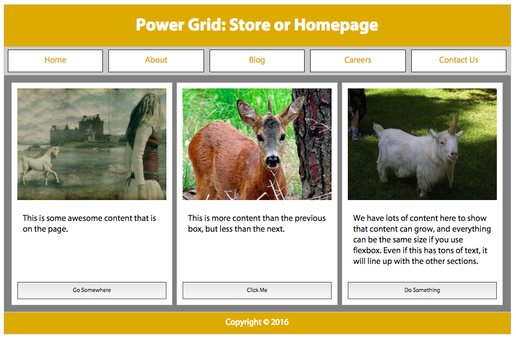
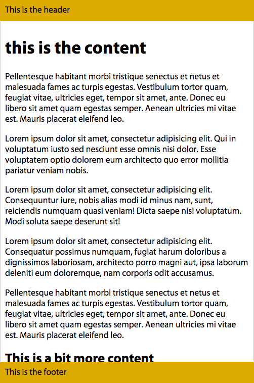

# Flexbox

The [CSS Flexible Box Module Level 1](http://www.w3.org/TR/css-flexbox-1/), or Flexbox for short, makes the once difficult task of laying out your page, widget, application or gallery almost simple. With Flexbox, layout is so simple you won't need a CSS framework. Widgets, carousels, responsive features -- whatever your designer dreams up -- will be a cinch to code.  And, while flexbox layout libraries have already popped up, instead of adding bloat to your markup, read this book, and learn how, with a few lines of CSS, you can create almost any responsive feature your site requires. 

### The problem addressed
 
By design, flexbox is direction-agnostic. This is different from block or inline layouts, which are defined to be vertically-biased and horizontally-biased, respectively. The web was originally designed for the creation of pages on monitors. Vertically-biased layout is insufficient for modern applications that change orientation, grow, and shrink depending on the user agent and the direction of the viewport, and change writing modes depending on the language.

Layout on the web has been a challenge for many. Challenging layout has long included vertical centering, to multiple column layout, to ensuring equal heights in a power grid of 2 to 5 side-by-side boxes, to fixing the buttons or "more" links in those boxes neatly aligned on the bottom of the box, with the buttons content neatly vertically centered, to ensuring boxes in a varied content gallery are all the same height, while they neatly line up with the boxes in subsequent rows, as shown in figure 1. Flexbox makes all of these challenges fairly simple.

[::LINK::](http://localhost/flexfiles/homepage.html)

[::LINK::](http://localhost/flexfiles/magiclayout.html)

[::LINK::](http://localhost/flexfiles/fixedfooter.html)

[::LINK::](http://localhost/flexfiles/button.html)

In the past, multiple column layouts were created by floating every column, with each column being a predetermined width and differing heights dependent on the column's content. While you can use faux background images with such a multiple column layout solution, or the `table` value of the `display` property, flexbox is a simple way to make the columns equal in height. Other than actually declaring a height, risking lots of white space or overflowing content, in the past there was no way to make all the columns equal in height.

> Note: Before floated layouts, it was common to see tables used for layout. Tables should not be used for layout for many reasons, including the fact that table layout is not semantic, difficult to updated if your layout changes, can be challenging to make accessible, adds to code bloat, and makes it more difficult to copy text. That said, tables are appropriate for tabular data. 

The [holy-grail layout](https://en.wikipedia.org/wiki/Holy_Grail_(web_design), with a header, 3-columns, and a footer, could be solved in many way, none of them simple, until we had flexbox: 

HTML:

    <header>Header</header>
    <main>
      <nav>Links</nav>
      <aside>Aside content</aside>
      <article>Document content</article>
    </main>
    <footer>Footer</footer>
 
CSS:

    main {
      background-image: url(images/fakecolumns.gif);
      width: 100%;
      float: left;
    }
    aside, nav {
      float: left;
      width: 25%;
      overflow: hidden;
    }
    article {
      float: left;
      width: 50%;
    } 

OUTPUT:

[::LINK::](flexfiles/float_layout.html)

Most designs call for columns of equal heights, but adding backgrounds to the above aside, article and nav would actually amplify that there are differing heights. To provide for the appearance of equal-height columns, we often added a faux-background to the parent based on the column widths declared in our CSS, as shown in figure 2. 

To ensure the parent was at least as tall as the floated columns, most developers added a 'clearfix' as generated content after the last column, though providing the parent with a width of 100% and floating it as well was an equally viable solution. 

A `clearfix` is a class that can be added to your CSS and then to any element to ensure it fully contains its floated children by adding diplayed block or table generated invisible content and clearing it, thereby clearing everything above it: 

    .clearfix:after {
        content: ".";
        display: block;
        height: 0;
        clear: both;
        visibility: hidden;
      }

   or 

    .clearfix:after {
      content: "";
      display: table;
      clear: both;
    }

When using this technique, an additional block descendant is inserted into the container  as generated content. This descendant is cleared of any floats in the inline or block direction. This forces the block size of the container, that has the `.clearfix` applied, to include the heights of the floats (these dimensions are normally not included since floats are removed from the flow). 

The method I used instead of adding a clearfix class and generated content was to take advantage of the fact that with CSS all floated elements must be at least as tall as its tallest floated descendant. By making the parent 100% wide and floating it, the parent would be at least as tall as it's tallest nested floated descendant while being alone on its own line. This floating method of clearing was supported in browsers before archaic versions of Internet Explorer began supporting generated content.

    main {
      width: 100%;
      float: left;
    }

The above layout is actually uglier that what is shown in figure 2. I added padding to make it look better, which caused the total width to be greater than 100%, causing the last column to drop. This is now easily resolved with `box-sizing: border-box;`. Adding a positive left or right margin would also cause the last column to drop, with no simple quick fix.

Between collapsing margins and dropping floats, the old layout method could be downright confusing. Many people started using YUI grids, Bootstrap, Foundation, 960 grid, and other CSS grid libraries to simplify their development process.  Hopefully your takeaway will be that you don't need a CSS crutch.

Note that flexbox was designed for a specific type of layout, that of single-dimensional content distribution. While you can create grid-like layouts (2-dimensional alignment) with flexbox, there is a [Grid specification](XXX link to grid specification), which with improved support, will be the [correct way of creating grids](link to Eric's grid chapter).

### Simple Solutions 

Flexbox is a simple and powerful way to layout web applications or sections of documents by dictating how space is distributed, content is aligned, and displays are visually ordered, enabling the appearance of stretching, shrinking, reversing and even rearranging the appearance of content without altering the underlying markup. Content can now easily be laid out vertically or horizontally, can appear to have the order rearranged, can be laid out along a single axis or wrapped across multiple lines, can grow naturally to encompass all the space available, or shrink to fit into the space allotted, and so much more. 

Flexbox is a declarative way to calculate and distribute space. Multiple column layouts are a breeze even if you don't know how many columns your content will have. Flexbox enables you to be confident your layout wont break when you dynamically generate more content, when content is removed, or when your user stretches or shrinks there browser or switches from portrait to landscape mode. 

With flexbox, visually rearranging content without impacting the underlying markup is easy. With flexbox, the appearance of content can be independent of source order. Though visually altered, flex properties should not impact the order of how the content is read by screen readers.![^1]

[^1] Screen readers following source order is in the specification, but Firefox currently follows the visual order. There is discussion in the accessibility community that this Firefox "bug" may be the correct behavior. It is possible that this spec may change.

And, importantly, with flexible box module layouts, elements can be made to behave predictably for different screen sizes and different display devices. Flexbox works well for responsive sites, as content can increase and decrease in size when the space provided is increased or decreased.

Flexbox can be used to map out an entire document through block layouts, or used inline to better position text. 

## Learning Flexbox 

Flexbox is a parent and child relationship. Flexbox layout is activated by declaring `display: flex;` or `display: inline-flex;` on an element which then becomes a flex container, arranging its children within the space provided and controls their layout.  The children of this flex container become flex items.

Flexbox works on an axis grid system. With flexbox you add CSS property values to a flex container element indicating how the children, the flex items, should be laid out. The children can be laid out from left to right, right to left, top to bottom or even bottom to top. The flex items are laid out side by side on a single line, or allowed, or even forced, to be wrapped onto multiple lines based on the flex containers flex property values. These children can be visually displayed as defined by the source order, reversed, or rearranged to any order of your choosing.

Should the children of your flex container not fill up the entire _main-axis_ (width or height) of the container, there are flexbox properties dictating how to handle the extra space, including preserving the space or distributing it between the children. When space is preserved, you can group the children to the left, the right, or centered, or you can spread them out, defining how the space is spread out either between or around the children. 

You can grow the children to take up all the available space by distributing that extra space among one, some or all of the flex items. You get to dictate how the children to grow by distributing the extra space evenly, proportionally or by set amounts.  The children can be aligned with respect to their container or each other, to the bottom, top or center of the container or stretched out to fill the container. Regardless of the difference in length among sibling container content, with flexbox you can make all the siblings the same size with a single CSS declaration.

If there isn't enough space to contain all the children, there are flexbox properties you can employ to dictate how the children should shrink to fit within their container.

Flexbox defines a formatting context along with properties to control layout. When you set an element to be laid out as a flexible box, it will only flex its immediate children, and not further descendants. However, you can make those descendants flexible boxes as well, enabling some really complex layouts. An element that has both a parent and a child can be both a flex container and a flex item.

Elements that aren't flexed, and are also not-absolutely positioned, have layout calculations biased to block and inline flow directions. Flex layout, on the other hand, is biased to the flex directions. The `flex-flow` value determines how content is mapped to the top, right, bottom, left, along a horizontal or vertical axes and by width and height.

Once you set an element to be a flex container, its children follow the flexbox rules for layout instead of the standard block, inline and inline-block rules. Within a flex container items line up on the "main-axis". The _main-axis_ can either be horizontal or vertical so you can arrange items into columns or rows. The main axis takes on the directionality set via the writing-mode: this _main-axis_ concept will be discussed in depth later on. 

In the next sections we'll cover how to make a flex container using the `display` property, then explain the various flex container properties to distribute and align flex items within the flex container. Once we've covered the properties applied to the flex container, we'll colver the properties applied directly to the flex items. We'll learn how to make the children of flex containers shrink and grow, and we'll discuss the properties applied to the those children that enable them to override the distribution and alignment globally set on all the flex items by the parent flex container. We've also included several flex box use cases.

### The `display` property

The first step is to turn an element into a flex container. This is done with two new values for the well known `display` property.

#### New values for the `display` property

---

`display`

 ** New Values:**

  flex | inline-flex

 **Inherited:**

  No

---

> 
    /* CSS 1 */
    display: inline;
    display: block;
    display: list-item;
    display: none;
>
    /* CSS 2.1 */
    display: inline-block;
    display: table;
    display: inline-table;
    display: table-row-group;
    display: table-header-group;
    display: table-footer-group;
    display: table-row;
    display: table-column-group;
    display: table-column;
    display: table-cell;
    display: table-caption;
    display: inherit;
>
    /* Newer Display Values */
    display: initial;
    display: unset;
    display: flex;
    display: inline-flex;
    display: grid;
    display: inline-grid;
    display: ruby;
    display: ruby-base;
    display: ruby-text;
    display: ruby-base-container;
    display: ruby-text-container;
>
    /* experimental values */
    display: run-in;
    display: contents;
    display: inline-list-item;
    display: flow;
    display: flow-root;

> There are currently 30 values for the `display` property descriped in the various specifications.  While not all of the Newer Display Values are fully supported at the time of this writing, they are expected to be included in all modern browsers. 

> The `run-in` and `compact` values were included in CSS2, but removed in CSS2.1. `run-in` made it back into [CSS Display Module Level 3](https://drafts.csswg.org/css-display/#display) along with `flow`, `flow-root` and `contents`. The `inline-list-item` value is included the [CSS Lists and Counters Module Level 3](https://drafts.csswg.org/css-lists/#valdef-display-inline-list-item) specification. All of these experimental values are still being discussed, and are not fully supported.

Two new values for the `display` property have been added in the [CSS Flexible Box Layout Module Level 1 specifiction](https://drafts.csswg.org/css-flexbox-1/#flex-containers): `flex` and `inline-flex`.  The value of `flex` turns the element on which it is applied into a block-level flex container box. Similarly, the `inline-flex` value turns the element on which it is applied into a flex-container block, but the flex container is an inline-level flex container box.

[::LINK::](flexfiles/flex_only.html)

Simply adding either of these `display` property values on an element turns the element into a flex container and the element's children into flex items. By default, the children are all the same height, even if their contents would produce elements of different heights, as shown in figure ?.

> For people familiar with float-based layouts, the default appearance that is created simply by adding these `display` values is similar to setting a container width to 100% and floating it and all its children to the left, or using the `.clearfix` method, but better. The children still fit on a single line, even if they may have wrapped if truly floated. And, just as how floated elements are at least as tall as their tallest floated children, the container will be tall enough to encompass its children. 

The `inline-flex` value makes the flex container behave like an inline-level element. It will be only as wide as declared, or as wide as one column if `flex-direction` is set to `column` (defined next). Like other inline-level elements, the `inline-flex` container sits together on a line with other inline-level elements, and is affected by the line-height and vertical alignment, which creates space for the descenders underneath the box by default. The `flex` value of the `display` property behaves like a block element.

> Note: We've added a padding, margins and borders to the flex container and items to improve the appearance of the figures. Box model properties do impact flex layout. Had we not included these properties, all the flex items would be bunched up against the flex container and against each other and would be indistinguishable from one another. In most examples, we've added border, margin and padding to the flex items and flex container for better figure legibility. The illustration explanations will not address the effects of the box model properties until we start covering some of the effects of box model layout in the [`align-content` section](link to align-content section) much later on in this chapter.

If we want to create a  navigation bar out of a group of links, it's very simple. Simply `display: flex;`.

    nav {
      display: flex;
    }

    <nav>
      <a href="#1">Home</a>
      <a href="#2">About</a>
      <a href="#3">Blog</a>
      <a href="#4">Careers</a>
      <a href="#5">Contact Us</a>
    </nav>

In the above code, with it's `display` property set to `flex`, the `<nav>` is turned into a flex container, and its child links are all flex items. These links are flex-level boxes, semantically still links, but now flex items in their presentation. They are not inline-level boxes: rather, they participate in their container’s flex formatting context. Therefore, the white space is ignored.  

    nav {
      display: flex;
      border-bottom: 1px solid #ccc;
    }
    a {
      margin: 0 5px;
      padding: 5px 15px;
      border-radius: 3px 3px 0 0;
      background-color: #ddaa00;
      text-decoration: none;
      color: #ffffff;
    }
    a:hover {
      background-color: #ffcc22;
      text-decoration: underline;
      color: black;
    }

With a little added CSS, we've got ourselves a simple tabbed navigation bar, as shown in figure ?.

[::LINK::](http://localhost/flexfiles/nav_displayflex.html)

A flex formatting context is similar to a block formatting context, except flex layout is used instead of block layout: floats do not intrude into the flex container, and the flex container’s margins do not collapse with the margins of its contents.

While there are similarities, flex containers are different from block containers. Some CSS properties do not apply in the flex context. The `column-*` properties, `::first-line` and `::first-letter` don't apply when it comes to the flex container. 

> The `::first-line` and `::first-letter` pseudo-elements, which select the first line and first letter of block level elements respectively, are described in the ? chapter. 

# Flex Container

The first important notion to fully understand is that of 'flex container', also known as 'container box'. The element on which `display: flex;` or `display: inline-flex;` is applied becomes a flex formatting context for the containing box's children, known as the 'flex container.' Once we have created a flex container (by adding a `display: flex` or `display: inline-flex`) we need to learn how to manipulate the layout of the container's children. 

The children of this container box are 'flex items', whether they are DOM nodes, text-nodes or generated content. Absolutely positioned children of flex containers are also flex items, but they are sized and positioned as though they are the only flex item in the flex container.

We will first learn all about the CSS properties that apply to the flex container, including several properties that impact the layout of flex items. Flex items themselves are a major concept you need to grok, and will be [covered in full](link to flex items chapter) after we have a full understanding of the flex container and its associated CSS properties.

## Flex container properties

The `display` property examples in Figure 3 show three flex items side-by-side, going from left to right, on one line. With a few additional property value declarations, we could have centered the items in their containing block, aligned them to the bottom of the container, rearranged their order of appearance, and laid them out from left to right or from top to bottom. We could even have made them span a few lines. 

Sometimes we'll have one flex item, sometimes we'll have dozens. Sometimes we'll know how many children a node will have. Sometimes the number of children will not be under our control. We might have a varied number of items in a set width container. We might know the number of items, but not know the width of the container. We should have robust CSS that can handle our layouts when we don't know how many flex items we'll have or how wide the flex container will be (think responsive). There are several properties outside of the new `display` values we can add to the flex container to provide control over layout that enable us to build responsive layouts and responsive widgets.

The `display`, `flex-direction`, `flex-wrap` and `flex-flow` properties impact the ordering and orientation of the flex container.  The `justify-content`, `align-items`, and `align-content` properties can be applied to the flex container to impact the alignment of the container's children.

## The `flex-flow` shorthand property

The `flex-flow` property let's you define the directions of the main and cross axes and whether the flex items can wrap to more than one line if needed.  

---

`flex-flow`

 **Values:**

    <flex-direction> || <flex-wrap>

 **Initial value:**

  row nowrap

 **Applies to:**

 flex containers

 **Inherited:**

No

 **Percentages:**

not applicable

 **Animatable:**

No

---

The `flex-flow` shorthand property sets the `flex-direction` and `flex-wrap` properties to define the flex container’s wrapping and main and cross axes. 

As long as `display` is set to `flex` or `inline-flex`, omitting `flex-flow`, `flex-direction` and `flex-wrap` is the same as declaring any of the following three:

    flex-flow: row;
    flex-flow: nowrap;
    flex-flow: row nowrap;

[::LINK::](http://localhost/flexfiles/04_flexflow.html)

In left to right writing modes, declaring any of the above or omitting the `flex-flow` property altogether, will create  a flex container with a horizontal main axis that doesn't wrap, as shown in in figure ?. Figure ? shows flex items distributed along the horizontal axis, on one line, overflowing the 500px-width container. 

So, what exactly does all this mean? While the specification's authors encourage the use of the `flex-flow` shorthand, understanding `flex-wrap` and `flex-direction`, the two properties that make up this shorthand, is necessary. And, by learning about the values that make up the `flex-flow` shorthand, we'll learn how to fix the unsightly layout shown in figure ?. 

## The `flex-direction` property

If you want your layout to go from top to bottom, left to right, right to left, or even bottom to top, you can use `flex-direction` to control the main axis along which the flex items get laid out. 

---

`flex-direction`

 **Values:**

  row | row-reverse | column | column-reverse

 **Initial value:**

  row

 **Applies to:**

 flex containers

 **Inherited:**

No

 **Percentages:**

not applicable

 **Animatable:**

No

---

The `flex-direction` property specifies how flex items are placed in the flex container. It defines the [main axis of a flex container](link to understanding axis section in this chapter) which is the primary axis along which flex items are laid out. 

[::LINK::](http://localhost/flexfiles/flex_direction.html)

Figure ? shows the four values of `flex-direction`, including `row`, `row-reverse`, `column`, and `column-reverse` in left to right languages. Note that all flex properties discussed here, like all CSS properties, accept the global values of `inherit`, `initial`, and `unset`.

We specified left to right languages, because the direction of the main axis for `row`  -- the direction the flex items are laid out in -- is the direction of the current writing mode. 

Preferably, we should have used the `flex-flow` shorthand property. The two right columns in table ? are equivalent:

| `flex-direction` | `flex-flow` | `flex-flow`|
| ---------------- | ----------- | ---------- |
| `row`            | `row`       | `row nowrap`|
| `row-reverse`    | `row-reverse` | `row-reverse nowrap`|
| `column`         | `column`    | `column nowrap` |
| `column-reverse` | `column-reverse;` | `column-reverse nowrap;`|

table ?: The values for `flex-direction` and `flex-flow` equivalents.

> ### Right to left Languages
> 
> If you're creating websites in English, or another left to right language, you likely want the flex items to be laid out from left to right, and from top to bottom. Defaulting or setting `row` will do that. If you're writing in Arabic, or other right to left language, you likely want the flex items to be laid out from right to left, and from top to bottom. Defaulting or setting `row` will do that for you too. 
> 
> `flex-direction: row` will lay the flex items in the same direction as the text direction, also known as the _writing mode_, whether it's a RTL or LTR language. While most websites are presented in left-to-right languages, some sites are in right to left languages, and yet others are top to bottom. With flexbox, you can include a single layout. When you change the writing mode, flex box will take care of changing the flex direction for you.

>The writing mode is set by the `writing-mode`, `direction`, and `text-orientation` properties or the `dir` attribute in HTML. When the writing mode is right-to-left -- whether set in HTML with the `dir="rtl"` attribute/value pair or via CSS with `direction: rtl;`-- the direction of the main axis, and therefor the flex items within the flex container, will go from right to left by default or when the `flex-direction: row` is set.
> 
>

> [::LINK::](http://localhost/flexfiles/flex_direction_rtl.html) XXX - CHANGE THIS TO ARABIC OR HEBREW NUMBERS

 You can reverse this with `flex-direction: row-reverse`. 

 The flex items will be laid out top to bottom when `flex-direction: column` is set, and from bottom to top if `flex-direction: column-reverse` is set, as shown in figure ?.
> 
> Note if the CSS `direction` value is different from the `dir` attribute value on an element, the CSS property value takes precedence over the HTML attribute. 
> 
> Do not use `flex-direction` to change the layout for right to left languages. Rather, use the `dir` attribute, or the `writing-mode` CSS property, which enables switching between horizontal and vertical, to indicate the language direction.

In horizontal writing modes, which includes left-to-right (LTR) and right-to-left (RTL) languages, setting `flex-direction: row`, `flex-flow: row`, `flex-flow: row nowrap`,  or ommitting both the longhand and shorthand properties so it defaults to `row`, will set all the flex items horizontally, side to side. By default, they will all be aligned horizontally, along the _main-axis_ line, in source order. In left-to-right languages, they will be aligned from left to right: the left side is referred to _main-start_ and the right is _main-end_, for the start and end points of the _main-axis_. In right-to-left languages the main direction is reversed: the flex items are side by side from right to left, with the _main-axis_ going from left to right, the right side being _main-start_ and left being _main-end_.

The `row-reverse` value is the same as `row`, except the flex items are laid out in the opposite direction of the text direction: the start and end points are reversed. The direction of the _main-axis_ of the flex container is  reversed by the `row-reverse` value. For left-to-right languages, like English, `row-reverse` will layout all the flex items side-to-side from right to left, horizontally, with _main-start_ being on the right and _main-end_ now on the left. These are shown in figure ?. 

Had the direction of the page or flex container been reversed, such as for Hebrew or Arabic, with the attribute `dir="rtl"` on the flex container or an ancestor in the HTML, or with `direction: rtl` on the flex container or container's ancestor in the CSS, the direction of the `row-reverse` main axis, and therefore the flex items, is inverted from the default, going left to right. Similarly, the `writing-mode` property impacts the direction in which the flex items are drawn to the page.

The `column` value will layout the flex items from top to bottom. The `column` value sets the flex container's _main-axis_ to be the same orientation as the block axis of the current writing mode. This is the vertical axis in horizontal writing modes and the horizontal axis in vertical writing modes. Basically, it sets the flex-container's _main-axis_ to vertical in most cases.

There are vertically written languages, inluding Bopomofo, Egyptian Hieroglyphs, Hiragana, Katakana, Han, Hangul, Meroitic Cursive and Hieroglyphs, Mongolian, Ogham, Old Turkic, Phags Pa, Yi and sometimes Japanese. These languages are only vertical when a vertical writing-mode is specified. If one isn't, then all of those languages are horizontal. If a vertical writing-mode is specified, then all of the content is vertical, whether one of the listed vertically written languages or even English.

>The `writing-mode` controls the block flow direction: the direction in which lines and blocks are stacked. The default value, `horizontal-tb`, stacks them top to bottom. The other values stack them right to left or left to right.

>The direction controls the inline base direction: the direction in which content within a line is ordered. LTR, short for "left-to-right" goes from nominal "left" to nominal "right". RTL, short for "right-to-left", is the opposite. Which side is nominally "left" for the purpose of direction is affected by the writing-mode: if the writing mode is vertical, the "left" side might be the top!

>The inline base direction is and should always be a property of the content.  Use the 'dir' attribute in HTML. Do not use the CSS `direction` property.  The `writing-mode` is a layout preference.[^1] Chinese, Japanese, and Korean can be written in either orientation. While English is a top to bottom, left to right language, you will sometimes see and may even use vertical writing for stylistic effect.

[^1]: Horizontal layout is incorrect for Mongolian. Because of this exception it's not really a "preference".

With `column`, the flex items are displayed in the same order as declared in the source document, but from top to bottom instead of left to right, so the flex items are laid out one on top of the next instead of side by side. 

    nav {
      display: flex;
      flex-direction: column;
      border-right: 1px solid #ccc;
    }
    a {
      margin: 5px;
      padding: 5px 15px;
      border-radius: 3px;
      background-color: #ccc;
      text-decoration: none;
      color: black;
    }
    a:hover {
      background-color: #aaa;
      text-decoration: underline;
    }

Using the same markup from our navigation example above, by simply changing a few CSS properties, we can create a nice sidebar style navigation. 

[::LINK::](http://localhost/flexfiles/nav_sidenav_direction.html)

For the navigation's new layout, we changed the `flex-direction` from the default `row` to `column`, moved the border from the bottom to the right, and changed the `border-radius` and `margin` values, as seen in Figure ?.

> ### Top to Bottom Languages

> For top to bottom languages, like Japanese, when `writing-mode: horizontal-tb;` is set and supported, the _main-axis_ is rotated 90 degrees clockwise from the default left to right, so `flex-direction: row` goes from top to bottom and `flex-direction: column;` proceeds from right to left, as shown in figure ?.

> [::LINK::](http://localhost/flexfiles/flex_direction_writingmode_ttb.html)

> The `writing-mode` property specifies the block flow direction, defining whether lines of text are laid out horizontally or vertically and the direction in which blocks progress. It defines the direction in which block-level containers are stacked and the direction in which text and other inline-level content flows within a block container. It is appropriate to use `writing-mode` for top to bottom languages, and to rotate text.  Don't use `writing-mode` to override the direction simply for layout reasons: instead, use the `flex-direction` property.

The `column-reverse` value is similar to `column`, except the main axis is reversed, with _main-start_ being at the bottom, and _main-end_ being at the top of the vertical _main-axis_, going upward, as laid out in figure ?.

The reverse values only change the appearance. The speech order and tab order remains the same, as the underlying markup.

What we've learned so far is super powerful, and makes layout a breeze. If we include the navigation within a full document, we can see how simple layout can be with flexbox. 

Let's expand a little on our HTML example from above, and include the navigation as a component within a home page:

    <body>
      <header>
        <h1>My Page's title!</h1>
      </header>
      <nav>
          <a href="#1">Home</a>
          <a href="#2">About</a>
          <a href="#3">Blog</a>
          <a href="#4">Careers</a>
          <a href="#5">Contact Us</a>
      </nav>
      <main>
          <article>
            
            
This is some awesome content that is on the page.

            <button>Go Somewhere</button>
          </article>
          <article>
            
            
This is more content than the previous box, but less than the next.

            <button>Click Me</button>
          </article>
          <article>
            
            
We have lots of content here to show that content can grow, and everything can be the same size if you use flexbox.

            <button>Do Something</button>
          </article>
      </main>
      <footer>Copyright &copy; 2016</footer>
    </body>

By simply adding a few lines of CSS, we've got a nicely laid out home page, as see in figure ?. 

[::LINK::](http://localhost/flexfiles/02_homepageexample.html)

    * {
      outline: 1px #ccc solid;
      margin: 10px;
      padding: 10px;
    }
    body, nav, main, article {
      display: flex;
    }
    body, article {
      flex-direction: column;
    }

It took two CSS property/value declarations to create the basic layout for a site home page.

Obviously there was some additional CSS. We added border, margin and padding to all the elements so you can differentiate the flex items for the sake of learning (I wouldn't put that less-that-attractive site in production). Otherwise, all we've done is simply declare the body, navigation, main and articles as flex containers, so the navigation, links, main, article, images, paragraphs and buttons are all flex items. Yes, elements can be both flex items while being flex containers, as we see with the navigation, main and articles in this case. The `body` and `article`s have `column` set as their flex directions, and we let `nav` and `main` default to `row`.  Just 2 lines of CSS!

But what happens when the flex items' _main-dimension_ (their combined widths for `row` or combined heights for `column`) don't fit within the flex container? We can either have them overflow, as shown in fgure ?, or we can allow them to wrap onto additional flex lines.

## The `flex-wrap` property

Thus far, the examples have shown a single row or column of flex items. If the flex items' _main-dimensions_ don't all fit across the _main-axis_ of the flex container, by default the flex items will not wrap. Rather, the flex items may shrink if allowed to do so via the flex item's [`flex` property](link to flex property in flex items chapter) and/or the flex items may overflow the bounding container box.  

You can control this behavior. The `flex-wrap` property can be set on the container to allow the flex items to wrap onto multiple flex lines -- rows or columns of flex items -- instead of having flex items overflow the container or shrink as they remain on one line. 

---

`flex-wrap`

 **Values:**

  nowrap | wrap | wrap-reverse

 **Initial value:**

  nowrap

 **Applies to:**

 flex containers

 **Inherited:**

No

 **Percentages:**

not applicable

 **Animatable:**

No

---

The `flex-wrap` property controls whether the flex container is limited to being a single-line container or is allowed to become multi-line if needed.  When the `flex-wrap` property is set to allow for multiple flex lines, whether the vlaue of `wrap` or `wrap-reverse` was set determines whether additional lines appear after or before the original line of flex items.

By default, no matter how many flex items there are, all the flex items are drawn on a single line. This is often not what we want. That's where `flex-wrap` comes into play. The `wrap` and `wrap-reverse` values allow the flex items  to wrap onto additional flex lines when the constraints of the parent flex container are reached.

[::LINK::](http://localhost/flexfiles/04_flexwrap.html)

Figure ? demonstrates the three values of `flex-wrap` property when the `flex-direction` value is defaulting to `row`. These examples show 2 flex lines: that second line and subsequent flex lines are added in the direction of the cross axis. 

Whether the additional flex lines are added above or below as in the case of figure ?, or to the left or to the right of the previous line as in [figure ?](the flex-wrap column image below) is determined by whether `wrap` or `wrap-reverse` is set and by the writing mode. 

Generally for `wrap`, the _cross-axis_ goes from top to bottom for `row` and `row-reverse` and the horizontal direction of the language for `column` and `column-reverse`.  The `wrap-reverse` value is similar to `wrap`, except that additional lines are added before the current line rather than after it. 

When set to `wrap-reverse`, directions are reversed: subsequent lines are drawn on top in the case of `flex-direction: row` and `flex-direction: row-reverse` and to the left of the previous column in the case of `flex-direction: column` and `flex-direction: column-reverse`. Similarly, in right to left languages, `flex-flow: row wrap-reverse` and `flex-flow: row-reverse wrap-reverse`, new lines will also be added on top, but for `flex-flow: column wrap-reverse` and `flex-flow: column-reverse wrap-reverse` new lines will be added to the right - the opposite of the language direction or writing mode, the direction of the inverted _cross-axis_. 

You may notice in figure ?, the new line created in the `wrap` and `wrap-reverse` examples are not the same height as the original may not all be the same size. Flex lines are as tall or wide as their tallest or widest flex item within that line. The flex line's main dimension is the main dimension of the flex container, while the flex line's cross dimension grows to fit the _cross size_ of the flex item with the largest _cross size_. 

While the examples thus far are fairly simple, as you may have noticed from the two previous paragraphs, fully understanding all the complexities of flexbox is not. The above explanation introduced possibly confusing terms like _main-axis_, _main-start_, and _main-end_ and _cross-axis_, _cross-start_ and _cross-end_. To fully grasp flexbox and all the flexbox properties, it is important to understand the concepts of _main_ and _cross_ axes upon which most flex properties are based.

To understand flex layout you need to understand the physical directions, axes, and sizes effecting the flex container and its flex items. Fully understanding what the specification means when it uses these terms will make fully understanding flexbox much easier. Flex layout is biased to flex directions, so you need to understand what the flex directions mean. 

### Understanding Axis

Flex items are laid out along the _main-axis_. Flex lines are added in the direction of the _cross-axis_. The _main-*_ terms have to do with flex items. The _cross-*_ terms come into play when `wrap` or `wrap-reverse` are set and the flex items actually wrap onto more than one line of flex items.

Up until we introduced `flex-wrap`, all the examples had a single line of flex items. That single line of flex items involved laying out the flex items along the _main axis_, in the main direction, from `main-start` to `main-end`.  Depending of the `flex-direction` property, those flex items were laid out side by side, top to bottom or bottom to top, in one row or column along the direction of the _main axis_. 

<table border="0" cellspacing="0" cellpadding="0">

  <tr>
    <th scope="col" rowspan="2">&nbsp;</th>
    <th scope="col" colspan="4">flex directions in LTR writing modes</th>
  </tr>
  <tr>
    <th scope="col">row</th>
    <th scope="col">row-reverse</th>
    <th scope="col">column</th>
    <th scope="col">column-reverse</th>
  </tr>
  <tr>
    <th scope="row">main-axis</th>
    <td>left to right</td>
    <td>right to left</td>
    <td>top to bottom</td>
    <td>bottom to top</td>
  </tr>
  <tr>
    <th scope="row">main dimension</th>
    <td>horizontal</td>
    <td>horizontal</td>
    <td>vertical</td>
    <td>vertical</td>
  </tr>
  <tr>
    <th scope="row">main-start</th>
    <td>left</td>
    <td>right</td>
    <td>top</td>
    <td>bottom</td>
  </tr>
  <tr>
    <th scope="row">main-end</th>
    <td>right</td>
    <td>left</td>
    <td>bottom</td>
    <td>top</td>
  </tr>
  <tr>
    <th scope="row">main-size</th>
    <td>width</td>
    <td>width</td>
    <td>height</td>
    <td>height</td>
  </tr>
  <tr>
    <th scope="row">cross-axis</th>
    <td>top to bottom</td>
    <td>top to bottom</td>
    <td>left to right</td>
    <td>left to right</td>
  </tr>
  <tr>
    <th scope="row">cross dimension</th>
    <td>vertical</td>
    <td>vertical</td>
    <td>horizontal</td>
    <td>horizontal</td>
  </tr>
  <tr>
    <th scope="row">cross-axis</th>
    <td>top to bottom</td>
    <td>top to bottom</td>
    <td>left to right</td>
    <td>left to right</td>
  </tr>
  <tr>
    <th scope="row">cross-start</th>
    <td>top</td>
    <td>top</td>
    <td>left</td>
    <td>left</td>
  </tr>
  <tr>
    <th scope="row">cross-end</th>
    <td>bottom</td>
    <td>bottom</td>
    <td>right</td>
    <td>right</td>
  </tr>
  <tr>
    <th scope="row">cross-size</th>
    <td>height</td>
    <td>height</td>
    <td>width</td>
    <td>width</td>
  </tr>
</table>

Table 1: Dimensions and directions of the _main-_ and _cross-axis_, along with their start point, end points, and directions in left to right layout.

Table 1 summarizes the _main-*_ and _cross-*_ terms.  It lists the dimensions and directions of the _main axis_ and _cross axis_, along with their start point, end points, and directions for left to right writing mode layouts for single line flex containers or ones on which `wrap` is set. In addition to describing the dimensions and direction of the flex container, these terms  can be used to describe the direction and dimension of individual flex items.

In the case of [figure ?](`flex-flow: row;` - img/1/03_flexflowrow.png), the sum of the _main-sizes_ of the non-wrappable line of flex items was greater than the _main-size_ of the flex container parent. In plainer English, the combined widths (and non-collapsed horizontal margins) of the flex items was wider than the width of the flex container. In horizontal writing modes, for `row` and `row-reverse`, the _main size_ refers to the **widths** of the flex items and flex container. In the case of `column` and `column-reverse`, the _main size_ is **height**. 

 

Figure ? shows the axes and the direction of each axis for the flex containers with a `flex-direction` of  `row`, `row-reverse`, `column` and `column-reverse` for LTR writing modes. 

The _main-axis_ is the primary axis along which flex items are laid out, with flex items being drawn along the _main-axis_ in the direction of  _main-start_ to _main-end_. 

If all writing modes were from left-to-right and top-to-bottom, like in English, `flex-direction` would be less complex. For LTR languages, `flex-direction: row` and `flex-direction: row-reverse` the _main-axis_ is horizontal.   In the case of `row`, the _main-start_ is on the left and _main-end_ is on the right. They're inverted for  `row-reverse`,  with the _main-start_  switching to the right and _main-end_ now on the left.  For `column`, the main axis is vertical, with _main-start_ on  top and _main-end_  on the bottom. For `column-reverse`, the _main axis_ is also vertical, but with _main-start_  on  bottom and _main-end_ is on the top.

Not all languages are left-to-right. As shown in table ?, when the writing mode is right-to-left, like in Arabic and Hebrew, if you have `dir="rtl"` set in your HTML, or `direction: rtl` set in your CSS, the direction of the text will go  from right to left. In these cases, the direction of `row` is reversed to be from right-to-left with _main-start_ on the right and _main-end_  on the left.   Similarly, the _main-axis_ for `row-reverse` will go from left to right, with _main-start_ being on the right. [1]  For `column`, the _main-start_ is still on the top and _main-end_ is on the bottom, just like for left-to-right languages, as both are top-to-bottom languages. 

<table border="0" cellspacing="0" cellpadding="0">

  <tr>
    <th scope="col" rowspan="2">&nbsp;</th>
    <th scope="col" colspan="4">flex directions in RTL writing modes</th>
  </tr>
  <tr>
    <th scope="col">row</th>
    <th scope="col">row-reverse</th>
    <th scope="col">column</th>
    <th scope="col">column-reverse</th>
  </tr>
  <tr>
    <th scope="row">main-axis</th>
    <td>right to left</td>
    <td>left to right</td>
    <td>top to bottom</td>
    <td>bottom to top</td>
  </tr>
  <tr>
    <th scope="row">main dimension</th>
    <td>horizontal</td>
    <td>horizontal</td>
    <td>vertical</td>
    <td>vertical</td>
  </tr>
  <tr>
    <th scope="row">main-start</th>
    <td>right</td>
    <td>left</td>
    <td>top</td>
    <td>bottom</td>
  </tr>
  <tr>
    <th scope="row">main-end</th>
    <td>left</td>
    <td>right</td>
    <td>bottom</td>
    <td>top</td>
  </tr>
  <tr>
    <th scope="row">main-size</th>
    <td>width</td>
    <td>width</td>
    <td>height</td>
    <td>height</td>
  </tr>
  <tr>
    <th scope="row">cross-axis</th>
    <td>top to bottom</td>
    <td>top to bottom</td>
    <td>left to right</td>
    <td>left to right</td>
  </tr>
  <tr>
    <th scope="row">cross dimension</th>
    <td>vertical</td>
    <td>vertical</td>
    <td>horizontal</td>
    <td>horizontal</td>
  </tr>
  <tr>
    <th scope="row">cross-axis</th>
    <td>top to bottom</td>
    <td>top to bottom</td>
    <td>right to left</td>
    <td>right to left</td>
  </tr>
  <tr>
    <th scope="row">cross-start</th>
    <td>top</td>
    <td>top</td>
    <td>right</td>
    <td>right</td>
  </tr>
  <tr>
    <th scope="row">cross-end</th>
    <td>bottom</td>
    <td>bottom</td>
    <td>left</td>
    <td>left</td>
  </tr>
  <tr>
    <th scope="row">cross-size</th>
    <td>height</td>
    <td>height</td>
    <td>width</td>
    <td>width</td>
  </tr>
</table>

Table 2: Dimensions and directions of the _main-_ and _cross-axis_, along with their start points, end points, and directions when writing mode is right to left.

If your site has `writing-mode: horizontal-tb;` set, as in [Figure ?0](img/1/02_flexdirection_ttb.png), the _main-axis_ of the content for `row` and `row-reverse` will be vertical, while `column` and `column-reverse` are horizontal. The `writing-mode` property is starting to get support in browsers, with support in Edge and Firefox, prefixed support in Chrome, Safari, Android and Opera, and support for an older syntax in Internet Explorer.

> While The CSS `direction` property along with the `unicode-bidi` can be used to control the direction of text, don't do it. It is recommended to use the `dir` attribute and CSS `writing-mode` property as HTML's `dir` attribute concerns HTML content and the `writing-mode` property concerns layout.  

It's important to understand things get reversed when writing direction is reversed. Now that you understand that, to make explaining (and understanding) flex layout much simpler, we're going to make the rest of the explanations and examples all be based on left-to-right writing mode, but will include how writing mode impacts the flex properties and features discussed.

How your flex layout appears on the screen is determined in part by interactions between `flex-flow` -- which includes `flex-direction` and `flex-wrap` -- and the writing mode. We've covered the direction in which flex items are added to a line of flex items, but when the end of the flex line is reached, how are new flex lines added?

When thinking about `flex-direction`, we now know the flex items are going to start being laid out across the main axis of the flex container, starting from the _main-start_. The _cross_ directions come into play when it comes to adding additional lines of flex items, known as `_flex lines_`. When the `flex-wrap` property is used to allow the container to wrap if the flex items don't fit onto one line, the _cross_ directions determine the direction of additional liners in multi-line flex containers. 

As we learned in the  [`flex-wrap` section](link to flex wrap above) of the [`flex-flow` shorthand](link to flex-flow) overview above, the flex items can be set to wrap to additional lines if they would otherwise be wider or taller than the _main size_ of the container. While the laying out of the flex items on each flex line is done in the main direction, going from _main-start_ to _main-end_, the wrapping to additional lines is done along the cross direction, from _cross-start_ to _cross-end_. 

The cross direction is the direction in which additional flex lines are added as needed.   The _cross-axis_ is perpendicular to the _main-axis_. As we see in figure ?, when we have horizontal rows of flex items, the _cross-axis_ is vertical. Flex lines are added in the direction of the _cross-axis_. In these examples, with `flex-flow: row wrap;` and `flex-flow: row-reverse wrap;` set on horizontal languages, new flex lines are added below preceeding flex lines.

The _cross-size_ is the opposite of _main-size_, being height for `row` and `row-reverse` and width for `column` and `column-reverse` in both RTL and LTR languages. Flex lines are filled with items and placed into the container, with lines added starting on the _cross-start_ side of the flex container and going toward the _cross-end_ side.

The `wrap-reverse` value inverts the direction of the _cross-axis_. Normally for `flex-direction` of `row` and `row-reverse`, the _cross-axis_ goes from top to bottom, with the _cross-start_ on top and _cross-end_ on the bottom. When `flex-wrap` is `wrap-reverse`, the _cross-start_ and _cross-end_ directions are swapped, with the _cross-start_ on the bottom, _cross-end_ on top, and the _cross-axis_ going from bottom to top. Additional flex lines get added on top of the previous line. 

If the `flex-direction` is set to `column` or `column-reverse`, by default the _cross-axis_ goes from left to right in left to right languages, with new flex lines being added to the right of previous lines. As shown in figure ?, when `flex-wrap` is set to `wrap-reverse`, the _cross-axis_ is inverted, with _cross-start_ being on the right, _cross-end_ being on the left, the _cross-axis_ going from right to left, with additional flex lines being added to the left of the previously drawn line. 

Note: We added [`align-items: flex-start;`](link to align-items)
and [`align-content: flex-start;`](link to align-content) to the flex container in figures ? and  ? to enunciate the height and directions of the flex lines. These properties are covered below. 

The `flex-wrap` property seemed fairly intuitive when it was described above. It turned out to be a bit more complex than it might have originally seemed. You may never implement reversed wrapping in a right to left language, but this is a "Definitive Guide." Now that we have a better understanding of the _cross-*_ dimensions, let's dig deeper into the `flex-wrap` property.

### `flex-wrap` continued

The default value of `nowrap` prevents wrapping, so the the `cross-` directions discussed above aren't relevant when there is no chance of a second flex line. When additional lines are possible -- when flex-wrap is set to `wrap` or `wrap-reverse` -- those lines will be added in the cross direction, which is perpendicular to the _main-axis_, The first line starts at the _cross-start_ with additional lines being added on the _cross-end_ side. 

The `wrap-reverse` value inverts the direction of the _cross-axis_. Normally for `flex-direction` of `row` and `row-reverse`, the _cross-axis_ goes from top to bottom, with the _cross-start_ on top and _cross-end_ on the bottom. When `flex-wrap` is `wrap-reverse`, the _cross-start_ and _cross-end_ directions are swapped, with the _cross-start_ on the bottom, _cross-end_ on top, and the _cross-axis_ going from bottom to top. Additional flex lines get added on top of the previous line. 

You can invert the direction of the _cross-axis_, adding new lines on top or to the left of previous lines by including `flex-wrap: wrap-reverse;`. In figures ?, ? and ?, the last example in each is `wrap-reverse`. You'll notice the new line starts at the _main-start_, but is added in the inverse direction of the _cross-axis_ set by the `flex-direction` property.
 
[::LINK::](http://localhost/flexfiles/04_flexwrap_col.html)

In figure ?, the same `flex-wrap` values are repeated, but with a `flex-direction: column` property value instead of `row`. In this case, the flex items are laid out along the vertical axis. Just as with the first example in figure ?-1, if wrapping is not enabled by the `flex-wrap` property, either because `flex-wrap: nowrap` is explicitly set on the container, or if the property is omitted and it defaults to `nowrap`. 

With `column`, just like with `row`, if the flex items don't fit into the flex container they'll overflow the flex container, unless explicitly changed with `min-width: 0` or similar, in which case they shrink to fit, though flex items will not shrink to smaller than their border, padding and margins combined. 

When `flex-direction: column; flex-wrap: wrap;` or `flex-flow: column wrap;` is set on a flex container, the flex item children are aligned along the _main-axis_. When the main direction of `column` is top to bottom, as it is for horizontal writing modes, the _cross-axis_ is the direction of the writing mode. This means in LTR modes, the first flex item is placed in the top left, which is the _main-start_ and _cross-start_ respectively. If there is room, the next item will be placed below it, along the _main-axis_. If there isn't enough room, the flex container will wrap the flex items onto new lines. The next flex item will be put on a new line, which is this case is a vertical line to the right of the previous line, as can be observed in the `flex-flow: column wrap;` example in [figure ?](img/1/04_flexwrap_with_column.png). In this case, the flex items have wrapped onto 3 lines. The flex items are wrapping onto new lines as the `height: 440px;` was set on the parent. Including a height forces the creation of new flex lines when the next flex item will not fit onto the current flex line.

When we include `flex-direction: column; flex-wrap: wrap-reverse;` or `flex-flow: column wrap-reverse;` and the _main-axis_ is the vertical axis, flex items are added below the previous flex item, if they can fit within the parent container. Because of the `wrap-reverse`, the _cross-axis_ is reversed meaning new lines are added in the opposite direction of the writing mode. As shown in [figure ?](img/1/05_flex_lines_wrap_reverse.png), columns are laid out right to left, instead of left-to-right as in the above example. The first column of flex items is on the left most side of the parent flex container. Any additional required columns will be added to the left of the previous column. Again, we're assuming a left to right default writing mode for all the examples.

In this example, the flex items are different heights based on their content. When divided across three lines, the last line is not filled. Since subsequent lines are being added to the left of previous lines, the empty space, if there is any, will be on the bottom left.  

As you can see, `flex-direction` and `flex-wrap` have great impact on your layout and on each other. Because it's generally important to set both if you're going to set either, we are provided with the `flex-flow` property, which is simply shorthand for `flex-direction` and `flex-wrap`.    

## Flex line cross dimension

In the `flex-flow` examples in [figure ?](img/1/03_flexflowrow.png), the flex items grew to fill the cross-dimension of the flex line they were on. This, and the fact that `nowrap` means all the flex items will be on a single line, is why the flex items are stretched filling the container. 

In the `flex-wrap` example in [figure ?](img/1/04_flexwrap.png), we had 2 flex lines. All the flex items in a single line were the same height, but the two flex lines were not of the same height: instead all the flex items were the same height as the tallest flex item within that same flex line.

By default, all flex items will appear to be the same height. We controlled this in [figure ?](img/1/05_flex_lines_row.png) and [figure ?](img/1/05_flex_lines_wrap_reverse.png) in order to highlite the how flex lines are drawn. This stretching (or overwriting of that stretching) is caused by the `stretch` default value of the [`justify-content` property, described below](link to justify-content). 

In those examples, you'll note the second row is not as wide as the flex container. When flex items are allowed to wrap onto multiple lines, by default all the items on one line will have the same cross dimension, which means all the items in a flex line of `row` and `row-reverse` will be the same height and all the items in a flex line of `column` or `column-reverse` will have the same width. 

Figure ? is an example in which `flex-flow: row-reverse wrap-reverse;` is set. This means the _main-axis_ is horizontal, going right-to-left, with a vertical _cross-axis_ going from bottom to top. Notice the extra space on the top left? New flex items get placed to the left of the previous ones, with new lines wrapping upwards, to the top of the previously filled row. By default, no matter the values of `flex-flow`, the empty space, if there is any, will be in the direction of _main-end_ and _cross-end_. There are other flex properties that will allow us to alter that. Let's look into those.