# Flex items
========================

In the previous chapters, we learned how to globally layout all the flex items within a flex container by adding flex box property values to that container. The flex box specification provides several additional properties applicable directly to DOM node and generated content flex items. With these flex item specific properties, we can more precisely control the layout of the flex container's DOM node children.  

 [::LINK::](30_flexitems.html) [XXX Please bold or italicize text betweeen the asterisks]

Now that we have a good understanding of the properties applicable to the flex container, it's time to focus on properties applicable to the flex items.

## What are Flex Items

We create flex containers simply by adding a `display: flex` or `display: inline-flex` to an element. The children of those flex container are called 'flex items', be they DOM nodes, non-empty text-nodes or generated content. 

When it comes to text-node children of flex containers, if the text node is not empty --  containing content other than white-space -- it will be wrapped in an anonymous flex item, behaving like its flex item siblings. While these anonymous flex items do inherit all the flex properties set by the flex container, just like their DOM node siblings, they are not directly targetable with CSS. Therefore, we can't directly set any of the flex item specific properties on them. 

Generated content can be targeted directly, therefore all the properties discussed in this chapter apply equally to generated content as they do to DOM nodes.

White-space only text nodes within a flex container are ignored, as if their `display` property were set to `none`. 

Example 1:

    nav ul {
      display: flex;
    }

    <nav>
      <ul>
        <li><a href="#1">Link 1</a></li>
        <li><a href="#2">Link 2</a></li>
        <li><a href="#3">Link 3</a></li>
        <li><a href="#4">Link 4</a></li>
        <li><a href="#5">Link 5</a></li>
      </ul>
    </nav>

In the above code, with it's `display` property set to `flex`, the unordered list is the flex container, and it's child list items are all flex items. These list items, being flex items, are flex-level boxes, semantically still list items, but not list items in their presentation. They are not block-level boxes either. Rather, they participate in their container’s flex formatting context. The white space is ignored. The links, which are descendants of the flex items, are not impacted by in inclusion of flex display on their grandparent. 

### Flex Item Features

The margins of flex items do not collapse.  The `float` and `clear` properties don't have an effect on flex items, and do not take a flex item out-of-flow. However, the `float` property can still affect box generation by influencing the `display` property’s computed value. Additionally, `vertical-align` has no effect on a flex item.

Code Example 2:

    aside {
      display: flex;
    }
    img {
      float: left;
    }

    <aside>
        <!-- this is a comment -->
        <h1>Header</h1>
        
        
        Some text
    </aside>

In example 2 , the `aside` is the flex container. The comment and white-space only text nodes are ignored. The text node containing "some text" is wrapped in an anonymous flex item.  The header, image and text node containing "some text" are all flex items. As the image is a flex item, the `float` is ignored. Even though images and text nodes are inline-level nodes, being flex items, they are blockified.

Code Example 3:

    aside {
      display: flex;
    }

    <aside>
        <!-- a comment -->
        <h1>Header</h1>
        
        
        Some text <a href="foo.html">with a link</a> and more text
    </aside>

In example 3, the markup is similar to the code in example 2, with the addition of a link within the non-empty text node.  In this case, we are creating 5 flex items. The comment and white-space only text nodes are ignored. The header, the image, the text node before the link, the link, and the text node after the link are all flex items. The text nodes containing "some text" and "and more text" are wrapped in anonymous flex items.  As these two text node children of the &lt;aside> are not contiguous, they are wrapped in separate anonymous flex items. The header, image, link, being DOM nodes can be targeted directly with CSS. The anonymous flex containers are not directly targetable. Even though images and text nodes are inline-level nodes, being flex items, they are blockified. 

### Absolute Positioning

While a value of `float: left` or `float: right` on the child of a flex container will do nothing -- as the child is a flex item and the `float` is ignored -- setting `position: absolute` is a different story. The absolutely-positioned children of flex containers, just like any other absolutely positioned element, are taken out of the flow of the document. 

They do not get converted to flex items. They are not in the document flow. They do not participate in flex layout. However, they can be impacted by the properties set on the flex container, just like a child can be impacted by a parent element that isn't a flex container. The parent’s alignment properties impact the static position of the absolute positioned flex item.

The absolutely positioned child of a flex container is impacted by both the `justify-content` value of the parent flex container and its own `align-self` value, if there is one. For example, if you set `align-content: center;` on the absolutely-positioned child, it will by default be centered on the flex container parent's cross-axis. The `order` property may not impact where the absolutely positioned flex container child is drawn, but it does impact the order of when it is drawn in relation to its siblings.

### min-width

In figure ?, you'll note the line that is set to the `nowrap` default overflows the flex container. This is because when it comes to flex items, the implied value of `min-width` is `auto`, rather than `0`. Originally in the specification, if the items didn't fit onto that single _main-axis_, they would shrink. However, the specification of `min-width` was altered. In the [CSS 2.1 specification the default value for `min-width` is`0`](https://drafts.csswg.org/css2/visudet.html#min-max-widths). Now, for flex items, the implied minimum size is `auto`, not `0`. 

[::LINK::](30_flexwrap_2.html) 

If you set the `min-width` to a width narrower than the computed value of auto -- for example, if we declare `min-width: 0;` -- the flex items in the the `nowrap` example will shrink to be narrower than the flex items in containers that are allowed to wrap, as shown in figure ?. This is what Safari 9 displays, as they have not updated the implied `min-width` change. We'll cover flex item width in greater depth when we discuss the [`flex` property](link to `flex` next).

[::LINK::](30_flexwrap_3.html) 

While the flex items alignment, order and flexibility are to some extent controllable via properties set on their parent flex container, there are several properties that can be applied to individual flex items for more granular control. 

The `flex` shorthand property, along with its component properties of `flex-grow`, `flex-shrink` and `flex-basis`, control the flexibility of the flex items. The `align-self` helps control a flex items alignment. The `order` property provides for more granular control of the visual ordering of individual or groups of flex items. All of these properties are discussed below.

### The `flex` property

The defining aspect of flex layout is the ability to make the flex items “flex”: altering their width or height to fill the available space in the main dimension. A flex container distributes free space to its items proportional to their flex grow factor, or shrinks them to prevent overflow proportional to their flex shrink factor. 

Defining the `flex` shorthand property on a flex item, or defining the individual properties that make up the shorthand, enables developers to define the grow and shrink factors. If there is excess space, you can tell the flex items to grow to fill that space. Or not. If there isn't enough room to fit all the flex items within the flex container at their defined or default sizes, you can tell the flex items to shrink proportionally to fit into the space. Or not. This is all done with the `flex` property, which is a shorthand property for `flex-grow`, `flex-shrink`, and `flex-basis`. While these three sub properties can be used separately, it is highly recommended to always use the `flex` shorthand. 

We will briefly introduce the `flex` shorthand property, then dive deeper into the three longhand values that make it up. It is important to fully understand what each component is doing so you can effectively use the `flex` shorthand property:

####  `flex` 

The `flex` shorthand, a flex item property, is made up of the `flex-grow`, `flex-shrink`, and `flex-basis` properties which define the flex growth factor, the flex shrink factor and the flex basis respectively.  

---

`flex`

 **Values:**

	[ <flex-grow> <flex-shrink>? || <flex-basis> ] | none | auto

 **Initial value:**

	flex-grow: 1;
	flex-shrink: 1;
	flex-basis: 0%;

 **Applies to:**

flex items (children of flex containers)

 **Inherited:**

No

 **Percentages:**

Valid for `flex-basis` value only, relative to element's parent's inner main-size. 

---

The `flex` property specifies the components of a flexible length determining the _main-size_ of the flex item. The "length" of the flex item being the length of the flex item along the _main-axis_[^1]. When a box is a flex item, `flex` is consulted instead of the _main-size_ (`height` or `width`) property  of the flex item to determine the size of the box. The "components" of the `flex` property include the flex growth factor, flex shrink factor, and the flex basis. If a DOM node is not a flex item, applying the `flex` property to it will have no effect.

[^1]: See Understanding Axis in Chapter 1.

The flex basis determines how the flex growth and shrink factors are implemented. As its name suggests, `flex-basis` component of the flex shorthand is the basis on which the flex item determines how much it can grow to fill available space or how much it should shrink to fit all the flex items when there isn't enough space. It's the initial size of each flex item, and can be restricted to that specific size by specifying 0 for both the growth and shrink factors.

	.flexItem {
		flex: 0 0 200px;
	}

In the above code snippet, the flex item will have a _main-size_ of exactly 200px as the flex basis is 200px, and it is neither allowed to grow or shrink.

It is important to understand the three components that make up the `flex` shorthand property, which is the property you should be employing. To ensure you fully grok `flex`, let's deep dive into its three components. 

The order of `flex` is important, with the first float number being the growth factor:

#### `flex-grow`

The `flex-grow` property defines whether a flex item is allowed to grow when there is available space, and, if it is allowed to grow and there is available space, how much will it grow proportionally relative to the growth of other flex item siblings.

---

`flex-grow`

 **Values:**

	<number>

 **Initial value:**

	flex-basis: 0; 
	1 when omitted as part of `flex` shorthand

 **Applies to:**

flex items (children of flex containers)

 **Inherited:**

No

 **Animatable:**

Yes

---

The value `flex-grow` and of the `flex-grow` portion of the `flex` shorthand is always a number. Negative numbers are not valid. Float values, as long as they are greater than 0, are valid.

The value specifies the growth factor, which determines how much the flex item will grow relative to the rest of the flex item siblings as the flex container's free space is distributed. If there is any available space within the flex container, the space will be distributed proportionally among the children with a non-zero positive growth factor based on the various values of those growth factors.

For example, with the `750px` wide horizontal flex container with three flex items all set to `width: 100px`, as in the four examples in figure ?, you can dictate none, one, two, or all three of the flex items to grow to fill the extra `450px` of available space. 

As noted when we discussed (min-width)[link to min-width section] above, if no width or flex basis is set, the flex basis defaults to `auto`, meaning each flex item basis is the width of its non-wrapped content. Had we not set the width, in this example scenario, with our smallish font size, we would had more than 450px of distributable space along the _main-axis_. 

> The examples in this section describe the basics of the growth factor. The main size of a flex item is impacted by the available space, the growth factor of all the flex items, as well as the flex basis of the item. We have yet to cover flex-basis. We will revisit both the growth and shrink factors and these examples when we learn about [flex basis](link to basis below).  

>Note that the amount of distributable space depends on the basis. In [figure ?](link to img/3/01_flexgrow.png), because the width of the flex items was set to 100px each and no basis was set, we have 450px of distributable space. When a different width or no width is declared, or if a basis is set, the distributable space is different, as shown in [figure ?](link to img/3/01b_flexgrow.png). 

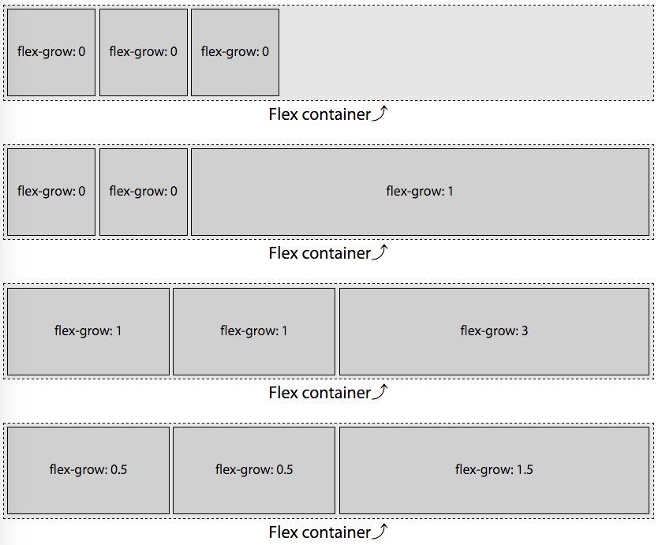[::LINK::](31_flexgrow.html)

Any positive value greater than `0` for the growth factor means the flex item can grow to fill a portion or all of the available space. You can tell the items not to grow with a growth factor of `0`, as demonstrated in the first example of figure ?. You can mix and match: growing some flex items and not others. 

In the four examples in figure ?, because the flex container is 750px wide and each of the 3 flex items has a `width :100px` declared, there are 450 extra pixels to be distributed among the flex items that are allowed to grow. 

    750px - (3 * 100px) = 450px

The first example has no growth factors set, so no flex items grow. We have 450px of empty space in the main end direction as `align-items` defaults to `flex-start`.

#### Non null growth factor

In the second example of figure ?, the first two flex items, with a growth factor set to `0`, will not grow. Only the third flex item has a value greater than `0`, with `flex-grow: 1` set, which means the single element with a positive growth factor value will take up all the extra available space. 

The first two flex items with flex growth factor of 0 will remain at `100px` wide, even if the content doesn't fit.  Only the third flex item is allowed to grow, and therefore it must grow, taking up the extra 450 pixels to become 550px wide. 

The growth factor needs to be a positive non-null float value for the flex item to grow.  In this example the growth factor was 1, but had it been 0.000001 or 10000000, the layout would be the same. 

#### Growing proportionally based on growth factor

If all items are allowed to grow, the excess space is distributed proportionally based on the flex growth factors. In the third example, with two flex items having a growth factor of 1, and one flex item having a growth factor of 3, we have a total of five growth factors:

     (2 x 1) + (1 x 3) = 5

With 5 growth factors, and a total of 450px needing to be distributed, each growth factor is worth 90px: 

    450px / 5 = 90px. 

Before being allowed to grow based on individual flex item's growth factor, the flex items were each 100px wide as set forth by the `width` property. With each growth factor being 90px, we have two flex items with a width of 190px each and the last flex item has a width of 370px:

    100px + (1 x 90px) = 190px
    100px + (3 x 90px) = 370px

In the last example, we have a total of 2.5 growth factors.

     (2 x 0.5) + (1 x 1.5) = 2.5
     
With 2.5 growth factors, and a total of 450px needing to be filled, each growth factor is worth 180px: 

    450px / 2.5 = 180px
    
Again, the default flex item size was 100px, with the flex basis defaulting to `auto`, leading us to have the exact same layout as in example 2. This demonstrates how the distribution of extra space is proportional.  Again we see two flex items with a width of 190px and the last flex item having a width of 370px:

    100px + (0.5 x 180px) = 190px
    100px + (1.5 x 180px) = 370px

Had we declared growth factors of 0.1, 0.1 and 0.3 respectively  or 25, 25, 75, the layout would have been identical.

### Growth factor with different widths

The available space is distributed proportionally among the flex items in each each flex row based on the flex growth factors. 

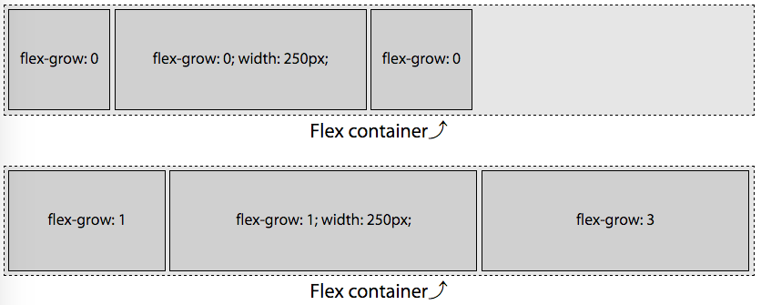[::LINK::](31_flexgrow2.html)

In figure ?, in the second example, we have flex items that are 100px, 250px and 100px wide, with growth factors of 1, 1 and 3 respectively, in a container that is 750px wide. This means we have 300px of extra space to distribute among a total of 5 growth factors. Each growth factor is therefore 60px, meaning the first and second flex items, with a growth factor of 1, will each grow by 60px, and the last will grow by 180px as the growth factor is set to 3.

The available space, growth factors and width of each growth factor are:

	Available space: 750px - (100px + 250px + 100px) = 300px
	Growth factors:  1 + 1 + 3 = 5
	Width of each growth factor: 300px / 5 = 60px
	
When flexed, the width based on their original width and growth factors become: 

	item1 = 100px + (1 * 60px) = 160px
	item2 = 250px + (1 * 60px) = 310px
	item3 = 100px + (3 * 60px) = 280px
	
	item1 + item2 + item3 = 160px + 310px + 280px = 750px

### Growth factors and the `flex` property

The `flex` property takes up to three values - the growth factor, shrink factor and basis. The first positive non-null float value, if there is one, is the growth factor. When the growth factor is omitted in the shorthand it defaults to 1. Otherwise, if neither `flex` nor `flex-grow` is included, it defaults to 0. 

In figure ?, because we declared a value for `flex-grow` only, the flex basis was set to `auto`. As if we had declared: 

    #example2 flex-item {
      flex: 0 1 auto;
    }
    #example2 flex-item:last-child {
      flex: 1 1 auto;
    }
    
Declaring `flex-grow` is strongly discouraged. Rather, declare the growth factor as part of the `flex` shorthand. 

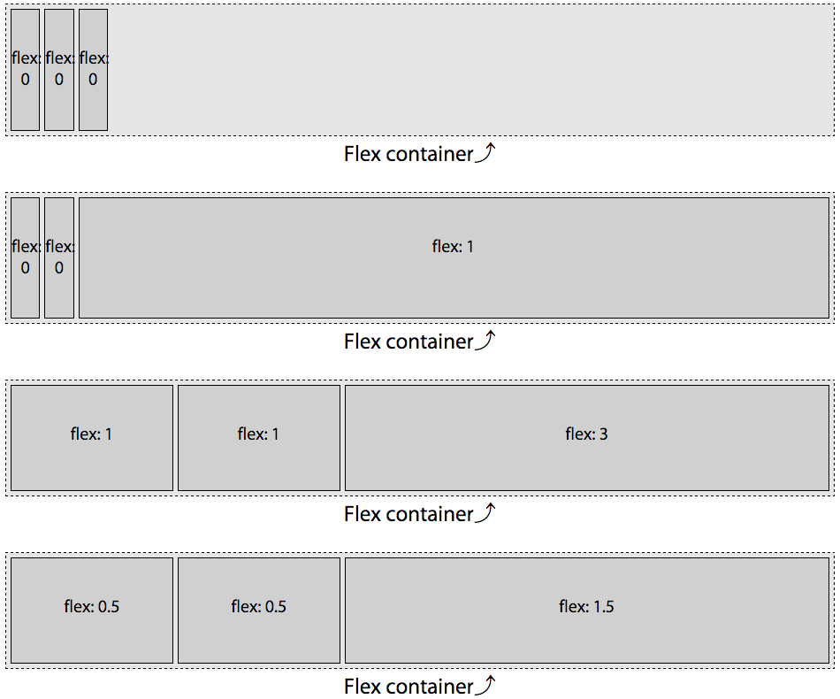[::LINK::](31b_flexgrow.html)

Had we declared `flex: 0`,  `flex: 0.5;`, `flex: 1;`, `flex: 1.5;`, and `flex: 3;` in [figure ?](figure # from 31_flexgrow.html) instead of ill-advisedly declaring`flex-grow` values, the flex basis would be set to 0%, and the first example would have been very different, as shown in figure ?. 

    #example2  flex-item {
      flex: 0 1 0%;
    }
    #example2  flex-item:last-child {
      flex: 1 1 0%;
    }

As the shrink factor defaults to 1 and the basis defaults to 0%, the following CSS is identical to the #example2 code above:

    #example2  flex-item {
      flex: 0;
    }
    #example2  flex-item:last-child {
      flex: 1;
    }
    
You may notice something odd: the flex basis been set to zero, and only the last flex item has a positive value for flex grow. Logic would seem that the widths of the three flex items should be 0, 0  and 750px respectively. But logic would also dictate that it makes no sense to have content over flowing their flex item if the flex container has the room for all the content, even if the basis is set to zero.

The specification authors thought of this quandary. When the `flex` property declaration explicitly sets or defaults the flex-basis to 0px and a flex item's growth factor is 0, the length of the _main-axis_ of the non-growing flex items will shrink to the smallest width the content allows, or smaller. In our example, the width is the width of the widest word "flex:". 

As long as a flex item has a visible overflow and no min-width (or min-height for vertical main-axes) explicitly set, the `min-width` (or `min-height`) will be the minimum width (or height) that the flex item needs to be to fit the content or the declared `width` (or `height`), whichever is smaller.  In the first and second examples in Figure ?, even though the growth factor is 0, the flex items don't shrink to 0. Rather, they shrink to the width of the widest non-breakable word, as the word "flex-" is narrower than 100px. Had `width: 10px` been set instead of `width: 100px`, the flex items would have narrowed down to whichever was smaller: the width of the word "flex-" or 10px. 

If all items are allowed to grow, and the flex basis for each flex item is 0%, all of the space -- the entire 750px rather than just excess space -- is distributed proportionally based on the growth factors. In the examples the flex container is 750px wide. In figure ?, as the flex basis is zero, rather than auto, all 750 of these pixels are distributed proportionally based on the flex growth factors. In the third example, with two flex items having growth factors of 1, and one flex item having a growth factor of 3, we have a total of five growth factors:

     (2 x 1) + (1 x 3) = 5

With 5 grows factors, and a total of 750px, each growth factor is worth 150px: 

    750px / 5 = 150px. 

While the default flex item size was 100px, the flex basis of 0% overrides that, leaving us with two flex items at 150px each and the last flex item with a width of 450px:

    1 x 150px = 150px
    3 x 150px = 450px
    150px + 150px + 450px = 750px

Similarly, in the last example of figure ?, with two flex items having growth factors of 0.5, and one flex item having a growth factor of 1.5, we have a total of 2.5 growth factors:

     (2 x 0.5) + (1 x 1.5) = 2.5

With 2.5 grows factors, and a total of 750px, each growth factor is worth 300px: 

    750px / 2.5 = 300px. 

While the default flex item size was 100px, the flex basis of 0% overrides that, leaving us with two flex items at 150px each and the last flex item with a width of 450px:

    0.5 x 300px = 150px
    1.5 x 300px = 450px
    150px + 150px + 450px = 750px    

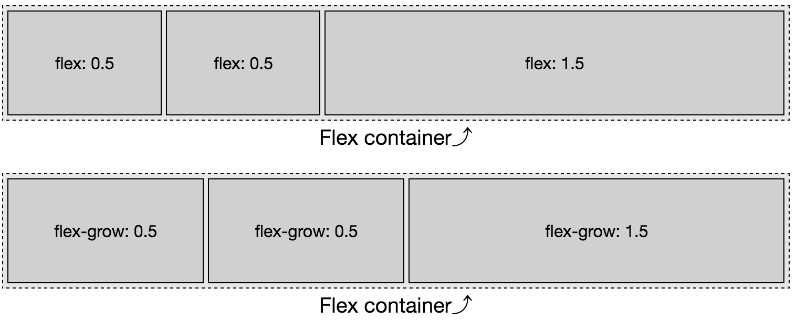[::LINK::](31c_flexgrow.html)

This is different from declaring only `flex-grow`, as shown in figure ?. Only declaring `flex-grow` means `flex-basis` defaults to auto. When set to auto, only the extra space, not all the space, is distributed proportionally. This lack of simplicity is why it is highly encouraged to always use the `flex` shorthand instead of `flex grow`, `flex-shrink` and `flex-basis` separately or not at all. 

While the available space is distributed proportionally based on the flex items' growth factor, the amount of available space is defined by the flex basis, which is discussed below. Let's first cover the shrinking factor.

#### `flex-shrink`

---

`flex-shrink`

 **Values:**

  &lt;number>

 **Initial value:**

  1 on it's own and as part of `flex` shorthand

 **Applies to:**

flex items (children of flex containers)

 **Inherited:**

No

 **Animatable:**

Yes

---

The `flex-shrink` portion of the `flex` shorthand property specifies the flex shrink factor. The shrink factor determines how much the flex item will shrink relative to the rest of the flex item siblings when there isn't enough space for them all to fit as defined by their content and other CSS properties. Basically, the shrink factor defines how the 'negative space' is distributed, or how flex items should become narrower or shorter, when the flex container parent isn't allowed to otherwise grow or wrap. 

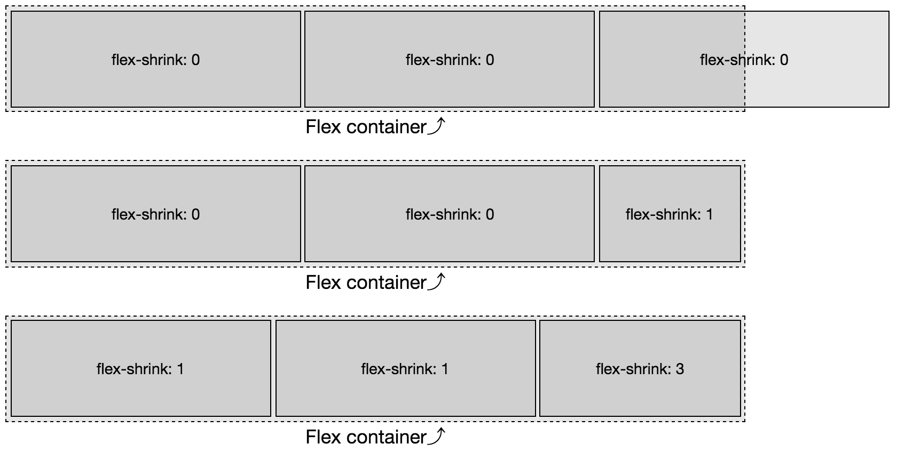[:LINK:](/flexfiles/32a_flexshrink.html)

Figure ? is similar to [figure ?](img/3/01_flexgrow.png), with the flex items set to 300px instead of 100px. We have a 750px wide flex container with three 300px-wide flex items. The total width of the three items is 900px, meaning the content is 150px wider than the parent flex container. If the items are not allowed to shrink or [wrap](link to flex-wrap), they will burst out from the fixed-size flex container. This is demonstrated in the first example in Figure ?: those items will not shrink as they have a null shrink factor. Instead, the flex items overflow the flex container along the _main-end_ side, as [`justify-content`](link to justify content in previous chapter) defaults to `flex-start`.

In the second example in figure ?, only the last flex item is set to be able to shrink. We forced the single element with a positive shrink factor to do all the shrinking necessary to enable all the flex items to fit within the container. With 900px worth of content needing to fit into our 750px container, we have 150px of negative space. The two flex items with no shrink factor stay at 300px wide. The third flex item, with the positive value for the shrink factor, shrinks down by 150 pixels, to be 150px wide, enabling the three items to fit within the container. In this example the shrink factor was 1, but had it been 0.000001 or 10000000, again, the layout would be the same. 

When omitted in the shorthand `flex` property value or when both `flex` and `flex-shrink` are omitted, the shrink factor defaults to 1. Like the growth factor, the value is always a number. Negative numbers are not valid. Floats, as long as they are greater than 0, are valid.

In the third example, we provided positive shrink factors for all three flex items:

    #example3 flex-item {
      flex-shrink: 1;
    }
    f#example3 flex-item:last-child {
      flex-shrink: 3;
    }

> Note: While we included the code above, our flex items will behave as if we had declared the following: 

    #example3 flex-item {
      flex: 0 1 auto;
    }
    f#example3 flex-item:last-child {
      flex: 0 3 auto;
    }

> This is likely not the layout you will be developing for production. So, use the `flex` shorthand. 

If all items are allowed to shrink, as is the case here, the shrinking is distributed proportionally based on the shrink factor of the individual items that have a positive value set for that property.

When all items have the same basis, it's easy to figure out how they will shrink based on the values of their string factors. With a parent 750px wide, and three flex items with a width of 300px, there are 150 extra pixels that need to be shaved off of the flex items that are allowed to shrink. With two flex items having a shrink factor of 1, and one flex item having a shrink factor of 3, we have a total of five shrink factors:

     (2 x 1) + (1 x 3) = 5

With 5 shrink factors, and a total of 150px needing to be shaved off all the flex items, each shrink factor is worth 30px: 

    150px / 5 = 30px. 

The default flex item size was 300px, leading us to have two flex items with a width of 270px each and the last flex item having a width of 210px, which total 750px. In shrinking proportionally based on their shrink factor, we have dictated how they shrink to fit in the space allotted:

    300px - (1 x 30px) = 270px
    300px - (3 x 30px) = 210px

    270px + 270px + 210px = 750px

The flex items will shrink to 210px, 210px and 270px respectively as long as the content (like media objects or non trappable text) within each flex item is not wider than 210px, 210px or 270px, respectively. 

    flex-item {
      flex: 1 0.25 auto;
    }
    flex-item:last-child {
      flex: 1 0.75 auto;
    }

The above produces the same outcome: while the shrink factors are different, they are proportionally the same.

A positive shrink value does not mean a flex item will necessarily shrink even if there isn't room available in the parent flex container for it and its siblings. If the flex item contains content that cannot wrap or otherwise shrink in the main-dimension, the flex item will not shrink.

If the first flex items contain a 300px wide image or an URL of characters wider than 300px.
	 
    item1 = 300px - (0 x 37.5px) = 300.0px
    item2 = 300px - (1 x 37.5px) = 262.5px
    item3 = 300px - (3 x 37.5px) = 187.5px
	 
In this case, the first item would be 300px, with the 150px of negative space distributed proportionally based on the shrink factors of the second and third flex items. That first flex item can not shrink, and other flex items can shrink, therefore it will not shrink, as if it had a null shrink factor. We have 4 unimpeded shrink factors for 150px of negative space, with each shrink factor being worth 37.5px.  The flex items are 300px, 262.5px and 187.5px respectively, for a total of 750px.

Had the image or URL in the first flex item been 296px wide, that first flex item would have been able to shrink by 4px. We would have then distributed the 146 of negative space among the four remaining shrink factors for flex items that were 296px, 263.5px and 190.5px wide respectively.

If all three flex items contained non-wrappable URLs, or media 300px or wider, the three flex items would not shrink, appearing similar to the first example in figure ?.

All the items had the same width or flex basis, therefore this is easy to calculate. Had they not had the same widths, this equation would be more complex. This only works this way because all the flex items had the same flex basis. 

#### Proportional based on width and shrink factor

The above was fairly simple as all the flex items started with the same width. But what if the widths were different? What if the first and last flex items had a width of 250px and the middle flex item had a width of 500px?

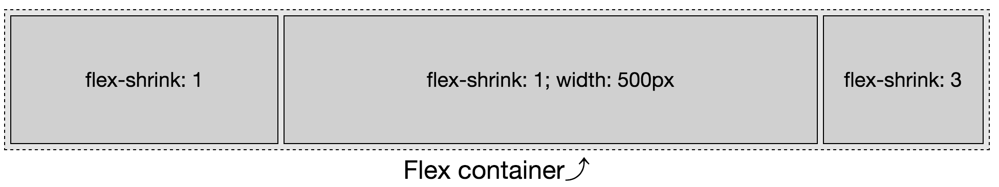

Flex items shrink proportionally relative to both the shrink factors and the flex item width. In figure ?, we are trying to fit 1000px into a 750px with flex container. We have an excess of 250px to be removed from 5 shrink factors. If this were a flow-grow concern, we would simply diving 250px by 5, allocating 50px per growth factor. If we shrank that way, we would see  200px, 550px and 100px wide flex items respectively. But that's not what we see.

Instead what we have is 1000 px trying to fit into 750px, This means we have 250px of negative space to proportionally distribute. To get the shrink factor proportion we divide the negative space by the actual space times their shrink factors.

	                            NegativeSpace 
	ShrinkPercent =  ----------------------------------------
	                ((width1 * ShrF1) + ... + (WidthN * Shr

Using this equation we learn the shrink factor percent: 

	= 250px / ((250px * 1) + (500px * 1) + (250px * 3))
	= 250px / 1500px
	= 0.166666667
	
When we reduce each flex item by 16.67% times the shrink factor, we end up with flex items that are reduced by:

	item1 = 250px * (1 * 16.67%) = 41.67px
	item2 = 500px * (1 * 16.67%) = 83.33px
	item3 = 250px * (3 * 16.67%) = 125px
   
We get flex items that are 208.33px, 416.67px and 125px wide respectively.

##### In the real world

Allowing flex items to shrink proportionally like this allows for responsive objects and layouts that can shrink proportionally without breaking.

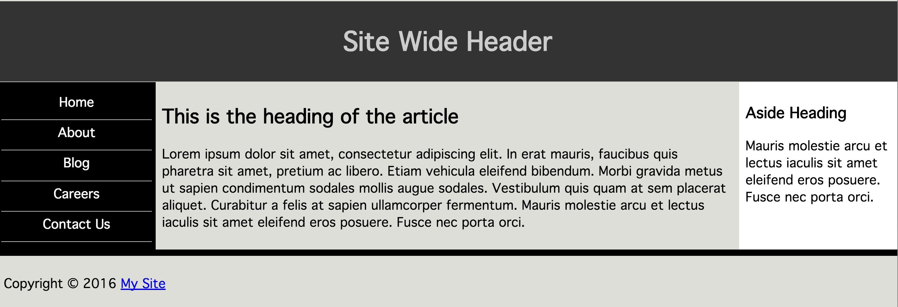

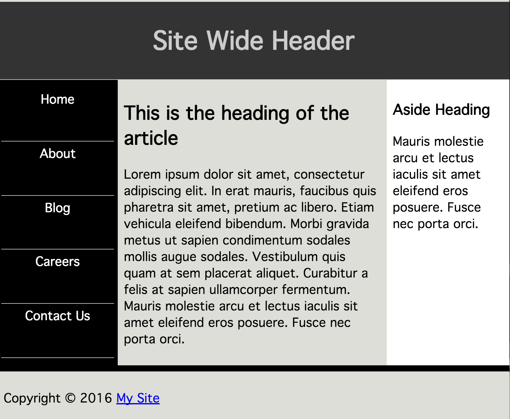

For example, you can create a 3-column layout where, that smartly grows and shrinks without media queries, as shown in figure ?. 

    nav {
      flex: 0 1 200px;
      min-width: 150px;
    }
    article {
      flex: 1 2 600px;
    }
    aside {
      flex: 0 1 200px;
      min-width: 150px;
    }

In this example, if the viewport is greater than 1000px, only the middle column grows by providing only the middle column with a growth factor, while dictating that below the 1000px width mark the right column shrinks twice as fast as the left two columns, using `min-width` to ensure the columns never shrinks below it's narrowest word or that minimum width, whichever is greater.

##### Differing bases

With a null shrink factor, if no width or basis is set on a flex item, it's content will not wrap.  When we have more content than could neatly fit on one line, a positive shrink value enables the content to wrap. Shrink factors, not only enable wrapping, but if all the flex items have similar shrink factors, because shrinking is proportional based on shrink factor, the content should wrap over a similar number of lines.

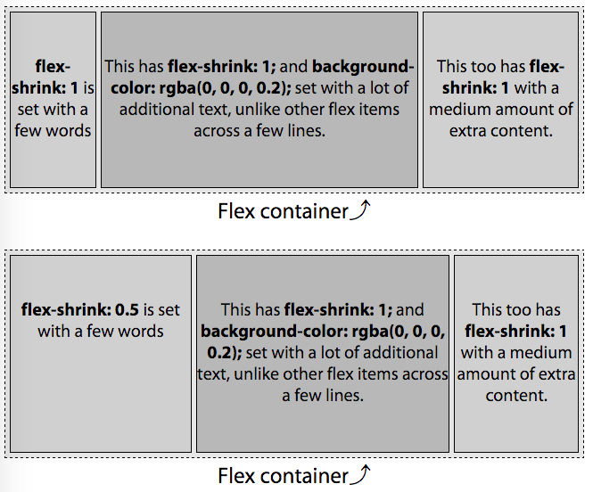[:LINK:](/flexfiles/32b_flexshrink.html)

Unlike in the previous examples in this chapter, in the two examples in figure ?, the flex items do not have a declared width. Rather, the width is based on the content - the width defaults to `auto`, as does the flex basis, [as if `flex-basis: content` were set](link to flex basis). 

You'll note in the first example, all content wraps over four lines. In the second example, the first flex item, with a shrink factor half of value of the other flex items, wraps over half the number of lines. This is the power of the shrink factor. 

Because the `flex` property's shrink factor reduces the width of flex items proportionally, the number of lines of text in the flex items will grow or shrink as the width shrinks or grows, leading to similar height content within sibling flex items when the shrink factors are similar. 

In the examples, the content of the flex items on my device are 280px, 995px, and 480px respectively - which I determined by setting a null shrink factor and using the developer tools' web inspector (and rounding to make this example a little simpler). This means we have to fit 1,755px of content into a 520px wide flex container by shrinking the flex items proportionally based on their shrink factor. This means we have 1235px of negative space to proportionally distribute.

Obviously you can't rely on web inspector tools to figure out shrink factors for production. We're going thru this exercise to understand how shrink factors work. If minutia isn't your thing, feel free to jump to [flex-basis](link to next section).

Because flex items shrink proportionally, based on the width of their content, in our example, the single line of text flex items will end up with the same, or approximately the same, number of lines.  

We didn't declare a width, therefore we can't simply use 300px as the basis as we did in the previous examples. Rather, we distribute the  1235px of negative space proportionally based on the widths of the content - 280px, 995px, and 480px respectively. We determine 520 is 29.63% of 1755. To determine the width of each flex item with a shrink factor of 1, we multiply the content width by 29.63%. 

	item1 = 280px * 29.63% =  83px
	item2 = 995px * 29.63% = 295px
	item3 = 480px * 29.63% = 142px
	
	item1 +  item2 + item3  =  83px + 295px + 142px = 520px
	
With the default of [`align-items: stretch;`](link to align-items in flex-container chapter) your three-column layout would have, by default, created three columns of equal height. By using a uniform shrink factor, you can dictate that the actual content of these three flex items be of equal height: though, by doing this, the width of those columns will not be uniform. The width of the flex items is the purview  of `flex-basis`.

In our second example, the flex items don't all have the same shrink factor. The first flex item will, proportionally, shrink half as much as the others. We start with the same widths: 280px, 995px, and 480px respectively, but the shrink factors are 0.5, 1.0 and 1.0 respectively. As we know the widths of the content, the shrink factor (X) can be found mathematically:

	(0.5X * 280px) + (1X * 995px) + (1X * 480px) = 1235px 
	1615X = 1235px 
	X = 1235px / 1615 
	X = 0.7647
	
We can find the final widths now that we know the shrink factor. If the shrink factor is 76.47%, it means that item2 and item3 will be 23.53% of their original widths, and item1, because it has a 0.5 shrink factor, will be 61.76% of it's original width:

	item1 = 280px * 0.6176 = 173px
	item2 = 995px * 0.2354 = 234px
	item3 = 480px * 0.2354 = 113px
	
	item1 + item2 + item3 =  173px + 234px + 113px = 520px
	
The total combined widths of these three flex items is 520px. 

Adding in varying shrink and growth factors makes it all a little less intuitive. That's why you likely want to always declare the flex shorthand, preferably with a width or basis set for each flex item.

If this doesn't make sense yet, don't worry, we'll cover a few more examples of shrinking as we discuss `flex-basis`. 

#### `flex-basis`

Again, while we are covering the `flex-basis` property individually here so you fully understand it, the CSS working group encourages declaring the basis as part of the `flex` shorthand property instead of on it's own. `flex` resets to common usage (rather than defaulting) the grow, shrink and basis values if any of them are not declared within the shorthand. When `flex-basis` is set, instead of `flex`, flex items can shrink but will not grow, as if `flex: 0 1 <flex-basis>` were set. 

Seriously, use `flex` instead of declaring the three longhand values separately. We're only covering the shorthand here because 1) this is the definitive guide, so we have to, and 2) so you fully understand what the `flex-basis` of the `flex` shorthand property does. By this point, I hope you've been convinced.

---

`flex-basis`

 **Values:**

  content | &lt;width>

 **Initial value:**

  auto

 **Applies to:**

flex items (children of flex containers)

 **Inherited:**

No

 **Percentages:**

Relative to flex container's inner main-size

 **Animatable:**

Yes, as width

---

As we've already seen, a flex item's size is impacted by its content and box model properties and can be reset via the three components of the `flex` property. The `flex-basis` component of the `flex` property defines the initial or default size of flex items, before extra or negative space is distributes -- before the flex items are allowed to grow or shrink according to the growth and shrink factors, which we described above. 

The basis determines the size of the content box, impacted by `box-sizing`. By default, when a block level element is not a flex item, the size is determined by the size of its parent, content, and box model properties. When no size properties are explicitly declared or inherited, the size defaults to its individual content, border and padding, which is 100% of the width of its parent for block level elements. 

The `flex-basis` property accepts the same length value types as the `width` and `height` properties -- like 5vw, 12%, and 300px -- or the keyterms `auto`, `initial`, `inherit` and `content`. 

None of the flex properties are inherited by default, but you can tell a flex item to inherit the flex-basis from its parent with the `inherit` value.

The global values of `initial` resets the flex basis to the initial value of `auto`, so you might as well declare `auto`. In turn, `auto` evaluates to the `width` (or `height`) if declared. The `main-size` keyword used to do this: it was part of an older specification, but was deprecated. If the value of `width` (or `height`) is set to `auto`, then the value is evaluated to `content`.

#### content 

The `content` keyword value is [not supported in most browsers](http://code.google.com/p/chromium/issues/detail?id=470421) at the time of this writing, with the exception of Microsoft Edge 12+, but is equal to the width or height of the content.  When `content` is used and supported, the basis is the size of the flex item's content - the value being the main size of the longest line of content or widest (or tallest) media object. 

Until support is complete, `flex-basis: content;` can be easily polly-filled as it is the equivalent of declaring `flex-basis: auto; width: auto;` on that flex item, or `flex-basis: auto; height: auto;` if the _main-dimension_ is vertical. Unfortunately, using `content` in the shorthand in non-support browsers invalidates the entire `flex` declarations.  

The value of `content` is basically what we saw in [figure ?](referring to figure img/3/03_flexshrink_multiplelines.png).

 [:LINK:](http://127.0.0.1:8887/flexfiles/33b_flexbasis_content.html)

In the first and third examples in figure ?, the width of the flex item is the size of the content; and the basis is also that width. In the first example, the flex items width and basis are approximately 132px. The total width of the three flex items side by side is 396px, fitting neatly into the parent container. 

In the third example, we have set a null shrink factor: this means the flex items cannot shrink, so they won't shrink or wrap to fit into the fixed-width flex container parent. Rather, they are the width of their non-wrapped text. That width is the value of the flex basis. The flex items' width and basis are approximately 309px, 1037px and 523px respectively. You can't see the full width of the second flex item or the third flex item at all, but they're in the [chapter files](http://127.0.0.1:8887/flexfiles/33b_flexbasis_content.html). 

The second example contains the same content as the third example, but the flex items are defaulting to `flex-shrink: 1`: the text in this example wraps because the flex items can shrink. So while the width of the flex item is not the width of the content, the flex basis - the basis by which it will proportionally shrink -- is the width of the content: 309px, 1037px and 523px respectively. 

When the shrink factors are the same, because flex items shrinking is proportional based on the content-width flex basis, they end up with the same or approximately the same number of lines.

> Tip: Until the `content` value is supported everywhere, you can replicate it by setting (or defaulting) the width/height and basis to `auto`.

It is the same as setting `flex-basis: auto; width: auto;` or `flex-basis: auto; height: auto;`

#### auto

When set to `auto`, or omitted, the `flex-basis` is the _main-size_ of the node had the element not been turned into a flex item. For length values, flex-basis is resolves to the `width` or `height` value, with the exception that when the value of the `width` or `height` is `auto`, the value  resolves to `content`. 

If the basis is explicitly set to `auto`, or omitted and therefore defaults to `auto`, and all the flex items can fit within the parent flex container, the flex items will be their pre-flexed size. If the flex items don't fit into their parent flex container, the flex items within that container will shrink proportionally based on their non-flexed main-sizes, unless the shrink factor is null, as seen in figure ?. 

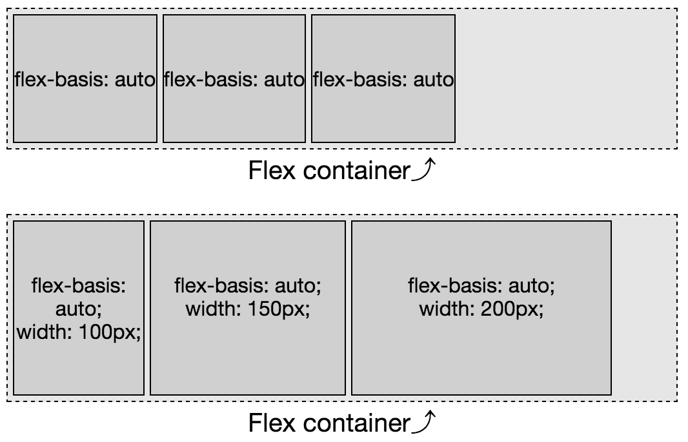 [:LINK:](http://127.0.0.1:8887/flexfiles/33a_flexbasis.html)

When there are no other properties setting the main size of the flex box (there's no `width` or even `min-width` set on these flex items), and `flex-basis: auto;` or `flex: 0 1 auto;` is set, the flex items will be only as wide as they need to be for the content to fit, as seen in the first example in figure ?. In this case, they are the width of the text "flex-basis: auto", which in this case, with this font, is approximately 110px. The flex items are their pre-flexed size, as if set to `display: inline-block;`. In this example, they're grouped at _main-start_ because the [flex container's `justify-content` defaults to `flex-start`](link to justify-content in previous chapter).

In the second example in figure ?, each of the flex items has flex basis of `auto` and a declared width. The _main-size_ of the node had the element not been turned into a flex items - if the parent was not a flex container - would be 100px, 150px and 200px. In using `flex-basis: auto` we are telling it to use those underlying box-model properties to determine the flex basis.

There's a little bit more to understanding of how `auto` works: underlying width. While the examples in this section used percentages and `auto`, when we discussed the growth and shrink factors above, the flex items had underlying widths of 100px and 300px respectively. Because the basis was not explicitly set to a length, the `width` value was the basis in those scenarios.

##### default values

When no `flex-basis` or `flex` is set, the flex item's main-size is be the pre-flex size of the item, as the default basis is `auto`

[::LINK::](http://127.0.0.1:8887/flexfiles/34_flexbasis_length.html)

In figure ? two things are happening: the flex bases are defaulting to `auto`, and, the shrink factor of each item is defaulting to 1. That means the bases are being set to the values of the `width` properties: 100px, 200px and 300px in the first example and 200px, 400px and 200px in the second example. For each, the flex basis is their individual `width` value. As the combined widths are 600px and 800px, which are both greater than the main-size of the containers, they are all shrinking proportionally to fit their 540px-wide parents. 

In the first example, we are trying to fit 600px in 540px, so each flex item will shrink by 10%, for flex items that are 90px, 180px and 270px. In our second examples, we are trying to fit 800px into 540px, making the flex items 135px, 270px and 135px.

##### length units

In the previous examples the basis defaulted to the declared widths of the various flex items. We can use the same length values for our flex-basis value as we do for `width` and `height`. 

[::LINK::](http://127.0.0.1:8887/flexfiles/34_flexbasis_vdithvlength.html)

When there are both flex-basis and width values, the basis trumps the width. Let's add bases values to the first example from [figure ?](img/3/04_flexbasis_length.png). The flex items include the following CSS:

    flex-container {
      width: 540px;
    }
    item1 {
      width: 100px; 
      flex-basis: 300px;  /* flex: 0 1 300px; */
    }
    item2 {
      width: 200px;
      flex-basie: 200px;  /* flex: 0 1 200px; */
    }
    item3 {
      width: 300px;
      flex-basis: 100px;  /* flex: 0 1 100px; */
    }

The widths are overridden by the bases. The flex items shrunk down to 270px, 180px and 90px respectively.

While the declared basis can override the main-size of flex items, the size can be impacted by other properties, such as `min-width`, `min-height`, `max-width` and `max-height`. These are not ignored.

###### Length Units: Percentages

Percentage values for `flex-basis` are relative to the size of the main dimension of the flex container. 

[::LINK::](http://127.0.0.1:8887/flexfiles/33a_flexbasis.html)

We've already seen the first example in figure ?. I am including it here to recall that the width of the text "flex-basis: auto" in this case, with my OS, browser and installed fonts, is approximately 110px wide. In this case only, declaring `flex-basis: auto` was the equivalent of `flex-basis: 110px`. 

    flex-container {
      width: 540px;
    }
    flex-item:last-child {
      flex: 0 1 100%;
    } 

In the second example in figure ?, the first two have a flex basis of auto with a default width of auto, which is as if their flex basis were set to `content`. As we've noted previously, the flex-basis of the first two items are set to 110px as the content is 110px wide. 

The last item is set to 100%. The percentage value is relative to the parent, which is 540px.  As the third item with a basis of 100% is not the only flex item within the non-wrapping flex container, it will not grow be 100% of the width of the parent flex container unless it's shrink factor is set with a null shrink factor or if it contains non-wrappable content that is as wide or wider than the parent container. This is not the case. Each flex item has only wrappable content and all three flex items are able to shrink as all have a default shrink factor of 1. 

> Remember: when the flex basis is a percent value, the _main-size_ is relative to the parent, which is the flex container. 

With our three flex bases, if the content is indeed 110px wide, and the container is 540px wide (ignoring other box model properties for simplicity's sake), we have a total of 760px to fit in a 540px space in this second example. With three flex items with flex bases equivalent to 110px, 110px and 540px respectively, we're trying to fit 760px of content into a 540px width container. We have 220px of negative space to distribute proportionally. The shrink factor is:

	Shrink factor = 220px / 760px = 28.95%

Each flex item will be shrunk by 28.95%, becoming 71.05% of the width they would have been had they not been allowed to shrink. We can figure the final widths:

	item1 =  110px * 71.05% =  78.16px
	item2 =  110px * 71.05% =  78.16px
	item3 =  540px * 71.05% = 383.68px
	
	item1 + item2 + item3 = 78.16px + 78.16px + 383.68px = 540px

These numbers hold true as long as the flex items can be that small: as long as none of the flex item contain media or a non-breaking word wider than 78.16px or 383.68px. This is the widest these flex items will be as long as the content can wrap to be that width or narrower. "Widest" because if one of the other two flex items can't shrink to be as narrow as this value, they'll have to absorb some of that negative space. 

In our third example, the `flex-basis: auto` item wraps over three lines. The CSS for this example is the equivalent of:

    flex-container {
      width: 540px;
    }
    item1 {
      flex: 0 1 70%;
    }
    item2 {
      flex: 0 1 auto;
    }
    item3 {
      flex: 0 1 80%;
    }

We declared the the `flex-basis` of the three flex items to be 70%, auto, and 80%, respectively. Remembering that "auto" is about 110px, which is the width of the text, the `min-content` in this `flex-basis: auto` scenario and our flex container is 540px in our example, the bases are the equivalent of:

	item1 = 70% * 540px = 378px 
	item2 = mincontent  = 110px
	item3 = 80% * 540px = 432px  

In this third example we have an item with a basis of 70%. This means the basis is 70% of the parent's 540px width, or 378px. The second item is set to `auto`, which in this case means 110px because of the width of the content. Lastly, we have flex item with a basis of 80%, meaning 80% of 540px, or 432px. When we add these three flex items, they have total combined with of 920px, that needs to fit into a flex container that is 540px wide. We have 380px of negative space to remove proportionally among the three flex items. To figure out the ratio, we divide the available width of our flex container by the sum of widths of the flex items that they would have if they couldn't shrink:

	Shrink Factor = (920px - 540px) / 920 = 0.413
	
	Proportional Width = 540px / 920px = 0.587

Because the shrink factors are all the same, this is fairly simple. Each item will be 58.7% of the width it would be if it had no flex item siblings. The shrink factor is 0.413, meaning We have to remove 41.3% of the width of each flex item, leaving us with 58.7% of the widths:

	item1 = 378px * 58.7% = 221.8px
	item2 = 110px * 58.7% =  64.6px
	item3 = 432px * 58.7% = 253.6px
	
What happens when the container is a different width? Say, 1000px? The flex basis would be 700px (70% x 1000px), 110px and 800px (80% x 1000px) respectively, for a total of 1610px.
	
	Proportional Width = 1000px / 1610px = 0.6211

	item1 = 700px * 62.11% = 434.8px
	item2 = 110px * 62.11% =  68.3px
	item3 = 800px * 62.11% = 496.9px
	
Because with a basis of 70% and 80%, the combined bases of the flex items will always be wider than 100%, no matter how wide we make the parent, all three items will always shrink. 

If the first flex item couldn't shrink, it would be 70% of the width of the parent - 378px in this case - as shown in figure ?. The other two flex items will shrink propotionally to fit into the remaining 30%, or  162px. In this case, you would expect widths to be 378px,  32.875px and 129.125px. As the text "basis:" is wider than that (at 42px on my device) we get 378px, 42px and 120px. 

Testing this out on your device will likely have slightly different results, as the width of the text "flex-basis: auto" may not be the same on your screen. 

##### Zero basis

If neither the `flex-basis` property nor the `flex` shorthand is included at all, the basis defaults to `auto`. When the flex property is included, but the basis component of the shorthand is omitted from the `flex` shorthand, the basis defaults to 0%. While on the surface you might think the two values of `auto` and `0` may seem similar, the `0` value is actually very different, and may not be what you expect. Once you understand it, you'll realize it's actually fairly intuitive.

The growth and shrink factors have completely different outcomes depending on whether the basis is set to `0` versus `auto`, as shown in figure ?. 

In the case of `flex-basis: auto;`, it is only the extra space that is distributed proportionally based on the flex growth factors. The basis is the main size of their content.
If the bases of all the flex items are `0`, the available space of the container is all space is all "available" space distributed proportionally based on the growth factors present.  In the case of a basis of 0%, the size of the container is divided up and proportionally distributed to each flex item based on their growth factors - their default original main-size as defined by `height`, `width` or `content`, is not taken into account, though `min-width`, `max-width`, `min-height` and `max-height` do impact the flexed size. 

As shown in this example, when the basis is `auto`, it is just the extra space that is divided up proportionally and added to each flex item set to grow. Again, assuming the width of the text "flex: X X auto" is 110px, in the first examples we have 210px to distribute among six growth factors, or 35px per growth factor. Our flex items are 180px, 145px and 215px wide, respectively.

In the second example, when the basis is 0, all 540px of the width is distributable space. With 540px of distributable space between 6 growth factors, each growth factor is worth  90px. Our flex items are 180px, 90px and 270px wide, respectively. Because our middle flex item is 90px wide and the content is 110px, that flex item wraps.

## flex shorthand property

Now that we have a fuller understanding of the properties that make up the `flex` shorthand, always use the `flex` shorthand. There are some commonly used shorthand values, including `initial`, `auto`, `none` and the use of an integer, usually `1`, meaning the flex item can grow. Let's go over all these values:

### common `flex` values

The common flex values are four flex values providing the most commonly-desired effects:

`flex: initial` sizes flex items based on the width/height properties, while allowing shrinking. `flex: auto` also sizes flex item based on the width/height properties, but makes them fully flexible, allowing both shrinking and growing. `flex: none` again sizes flex item based on the width/height properties, but makes them completely inflexible: they can't shrink or grow. `flex: n` doesn't care about the width/height properties as the shrink factor is set to 0, so obviously needs to be flexible, or it wouldn't be visible if it wasn't allowed to grow beyond that 0. In this case, the flex item's size is be proportional to the flex factor `n`.

**`flex: initial`** 
`Initial` is a global CSS keyword, which means `initial` can be used on all properties to represent the property’s initial value. 

	flex: initial;
	flex: 0 1 auto;

The above two lines are the same: `flex: initial` is the equivalent of `flex: 0 1 auto`. This means the flex items size will be based on their own width and height properties, or based on the contents if the main-size isn't explicitly set (set or defaulting to `auto`). If the flex container is not large enough for the flex items, the flex items can be shrunk, but the flex items will not grow even if there extra distributable space available.

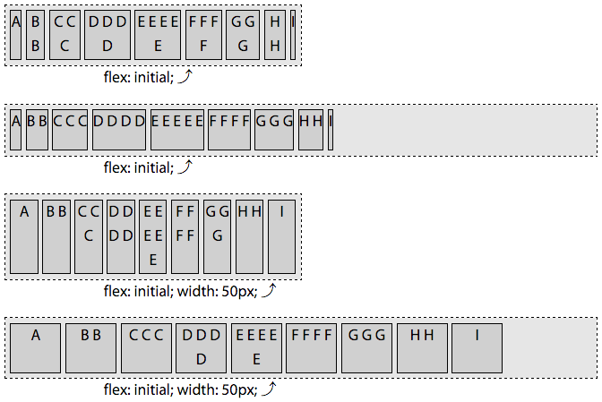[:LINK:](http://127.0.0.1:8887/flexfiles/36_flex_initial.html)

Declaring `flex: initial` sets a null growth factor, a shrink factor of `1`, and sets the flex bases to `auto`. In figure ?, we can see the effect of the `auto` flex bases. In the first two examples, the basis is `content` - with each flex item having the width of the single line of letters that make up the content of each flex item. In the last two examples, the flex bases of all the items are the same, at 50px, as `width: 50px` has been applied to all the flex items.  The flex: initial declaration sets the flex-basis to auto, which we previously means it the value is the width or height, if declared, or `content` if not declared.

In the first and third examples  in figure ?, we see how, if the flex container is too small to fit all the flex items at their default main-size, the flex items will shrink, with all the flex items fitting within the parent flex container. In these examples, the combined flex bases of all the flex items are greater than the main-size of the flex container. In the first example, the shrink bases are all different. They all shrink proportionally based on their shrink factor. In the third example, with each flex item's basis being 50px, all the items shrink equally.  

In the first example, you'll note the last flex item, with the single narrow capital letter `I`, is the narrowest flex item in the group, followed by `A`. `B` and `H` are wider than `A` and `I`, even though with the wrapping caused by the shrinking, causes these flex items to be only one letter wide. The flex items with more letters in the content are wider because flex-basis is based on the width of the content. `A` and `I` are one letter wide. The basis for `B` and `H` are based on the width of two space-separated letters. Similarly, `D` and `F` are wider than `C` and `G`: `D` and `F` both have an extra letter and spaceworth of width in their basis.

In the second and fourth examples, the flex items all fit, so there is no shrinkage. When `flex: initial` is set, the growth factor is null, so the flex items can't grow. 

Flex items, by default, are grouped at main start, as `flex-start` is the default value of for the `justify-content` property. This is only noticable when the combined main sizes of the flex items on a flex line are smaller than the main size of the flex container.    

**`flex: auto`**  
Setting `flex: auto;` on a flex item is the same as setting `flex: 1 1 auto`. The following two statements are equivalent:

	flex: auto;
	flex: 1 1 auto;

`flex: auto` is similar to `flex: initial`, but makes the flex items flexible in both directions: they'll shrink if there isn't enough room to fit all the items within the container, and they'll grow to take up all the extra space within the container if there is distributable space. The flex items absorb any free space along the main-axis. 

[:LINK:](http://127.0.0.1:8887/flexfiles/36_flex_initial.html)

You'll note the first and third examples of figure ? are identical and the examples in figure ?, as the shrinking and bases are the same. However, the second and fourth examples are different, as when `flex: auto` is set, the growth factor is not null.

**`flex: none`** 
Setting `flex: none` is equivalent to setting `flex: 0 0 auto`, making the  the following two lines of CSS equivalent:

	flex: none;
	flex: 0 0 auto;

The `flex: none` items are inflexible: the flex items will neither shrink nor grow. 

[:LINK:](http://127.0.0.1:8887/flexfiles/36_flex_initial.html)

As demonstrated in the first and third examples of figure ?, if there isn't enough space, the flex items overflow the flex container. This is different from `flex: initial` and `flex: auto`, which both set a positive shrink factor. 

The basis resolves to `auto`, meaning each flex items' main size is determined by the _main-size_ of the node had the element not been turned into a flex item: the flex-basis resolves to the `width` or `height` value. If that value resolved to `auto`, the basis will be the main-size of the content. In the first two examples that means the basis, and the width since there is no growing or shrinking, is the width of the content. In the third and fourth examples, that means the width and basis are all 50px across.

**`flex: n`** 
When the values of the `flex` property is a single, positive numeric value, that value will be the growth factor, while the shrink factor will default to 0, and the basis will default to 0%. 

	flex-grow: n;
	flex-shrink: 0;
	flex-basis: 0%;

The following two CSS declarations are equivalent:  

	flex: 3;
	flex: 3 0 0%;

Declaring `flex: 3` is the same as declaring `flex: 3 0 0%`. This makes the flex item on which it is set flexible: it can  grow. The shrink factor is actually moot, as it sets the `flex-basis` to `0%` and the flex item, even if a positive shrink factor were declared, can not be less than 0. 

[:LINK:](http://127.0.0.1:8887/flexfiles/36_flex_initial.html)

In the first two examples in figure ?, all the flex items have a flex growth factor of 3. All the flex items in each example are the same width. While in figure ?, ? and ? [initial, auto and none], the flex items shrank to fit the flex container parent, when you set `flex: n`, where `n` is any positive float, the basis is 0. With all the flex items having a basis of 0, 100% of the main dimension is distributable space. This holds true for the second example as well. The main size of the flex items are wider in this second example as the wider parent has more distributable space.   

Any value for `n` that is greater than 0, even 0.1, means the flex item can grow. The `n` is the growth factor. When there is available space to grow, if only one flex item has a positive growth factor, that item will take up all the available space. If all the items can grow, the available extra space will be distributed proportionally to each flex item based on to their growth factor. In the case of all the flex items having `flex: n` declared, where `n` is a single or variety of positive numbers, the growth will be proportional based only on `n`, not on the underlying width, as the basis for each flex item is `0`.

In the last three examples of figure ?, there are 6 flex items with `flex: 0`, `flex: 1`, `flex: 2`, `flex: 3`, `flex: 4`, and `flex: 5` declared respectively. These are the growth factors for the size flex items, which each having a shrink factor of 0 and a basis of 0. The main size of each is proportional to the specified flex growth factor. 

There are 15 total growth factors distributed across six flex items. The narrow flex container is 300px wide, meaning each growth factor is worth 20px. This means the widths of the flex items will be 0, 20px, 40px, 60px, 80px and 100px, for a total of 300px. The last example has a width of 600px, meaning each growth factor is worth 40px. This leaves us with flex items that are 0, 40px, 80px, 120px, 160px, and 200px, for a total of 600px.

We added a bit of padding, margins and borders on the example to make the visuals more pleasing. For this reason, the left-most flex item, with `flex: 0` declared, is visible: it has a 1px border making it visible even though it's 0px wide.

[:LINK:](http://127.0.0.1:8887/flexfiles/36_flex_initial.html)

If we had declared a width on these flex items, it would have made no difference. Setting `flex: 0`, `flex: 5` or any other values for `n` in `flex: n` set the flex-basis to 0%. You'll see no difference between figure ? and figure ?, other than the "width: 50px" in the paragraph below each flex container.

### custom flex values

The above, `flex: initial`, `flex: auto`, `flex: none` and `flex: n`, are preset values. While these are provided as they are the most commonly values, they may not meet all your needs, and they don't provide as much flexibility as defining your own custom flex values.

When `flex-basis` is set to `auto`, as shown in the first example in  figure ?, the main-size of each flex item is based on the content. Based on the growth factor, you may have thought the middle item would be the narrrowest as the growth factor is the smallest, but there is no "growing". In this exampe there is no available distributable space. In this case the flex items' content are all of equal height, as the size of each is based on the flex basis, rather than the growth factor. And, yes, had there been extra available space, it would have been divided up proportionally by each flex items' `flex-grow` factor.

In the second example in figure ?, the basis is 0, so the main size is determined by the various growth factors. In this case, the first flex item, with `flex: 2 1 0%` is twice as wide as the second flex item with `flex: 1 1 0%`. This second item, in turn, has a main size that is one third as wide as the last flex item with `flex: 3 1 0%;`. 

We included a shrink factor in this example to make it parallel to the the first example, but it was completely not necessary. When using a 0 (or 0%) basis, the shrink factor has not impact on the main size of the flex items. We could have included any of the three statements in each declaration:

  item1 {
    flex: 2 1 0%;
    flex: 2 0 0%;
    flex: 2;
  }
  item2 {
    flex: 1 1 0%;
    flex: 1 0 0%;
    flex: 1;
  }
  item3 {
    flex: 3 1 0%;
    flex: 3 0 0%;
    flex: 3;
  }

In these two examples, there was no `width` set on the flex items. By default, flex items won't shrink below their minimum content size (the length of the longest word or fixed-size element). To change this, set the `min-width` or `min-height` property. For the examples in figure ?, had `min-width: 200px` been set on the second flex item, in both cases, the width would have been 200px. 

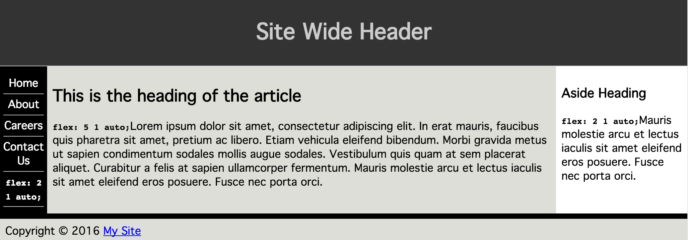[:LINK:](flexfiles/37_flexshrink_auto.html)

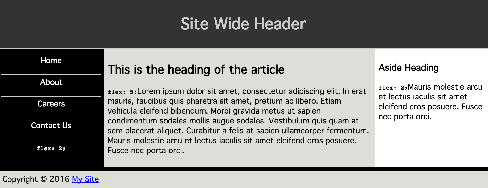[:LINK:](flexfiles/37_flexshrink_0.html)

How can this help in practice? While in theory the similar height columns we get with `auto` seems like a good idea, in reality controlling the widths of the columns in a multi-column layout is likely a greater priority, as demonstrated by the difference in the two layouts in figure ?.

The first example's flex basis is based on the content. For the navigation, the longest line is the link with the longest content. If the article or aside contained a line break in the long and longer paragraphs, their widths would change. In the second example, the nav and aside will always each be 22% of the width of the main area, unless they contain a component that is wider than 22%. The main article will be 56% of the width. You can include a `min-width` on any or all of the items to ensure the layout never gets too narrow, or you can use media queries to let the components drop on very narrow screens. So many options!

The following CSS was used to create the second example:

  @media screen and (min-width: 500px) {

    main {
      display: flex;
    }
    nav {
      order: -1;
      flex: 2;
      min-width: 150px;
    }
    article {
      flex: 5;
    }
    aside {
      flex: 2;
      min-width: 150px;
    }
  }

We'll [cover this example again](link to the example within the `order` section) when we discuss the `order` property next. Quickly: in the markup the nav is last, and it will come last on a viewport that is less than 500px wide. On wider screens that have room for the 3-columns, it will come first in appearance. Screen readers will still read it in source order. Tabbing will still make it appear last.

#### Sticky-footer with `flex`

Obviously, `flex` can be used for a lot of designs. A common one is creating a  sticky footer. A sticky footer is a fixed-height footer is at the bottom of the document, sticking to the bottom of the browser window even when the document would otherwise be shorter than the browser window.

As you can see in figure ?, when the document gets taller, the footer sticks to the bottom of the window.

    <body>
      <header>...</header>
      <main>
        <nav>
          <a href="#1">Home</a>
          <a href="#2">About</a>
          <a href="#3">Blog</a>
          <a href="#4">Careers</a>
          <a href="#5">Contact Us</a>
        </nav>
         <article>... </article>
         <aside>... </aside>
      </main>
      <footer>
        <a href="#1">Home</a>
        <a href="#2">About</a>
        <a href="#3">Blog</a>
        <a href="#4">Careers</a>
        <a href="#5">Contact Us</a>
      </footer>
    </body>

This is a very common way of marking up a typical website. With a few lines of CSS, we can create the sticky-footer.

    body {
      display: flex;
      flex-direction: column;
      min-height: 100vh;
    }
    main {
      flex: 1;
    }
    footer {
      height: 3rem;
    }

If you define the body to be a flex container at least as tall as the browser window, and define the main area of the page to be able to grow, when you give the footer a defined height, it will always be that height, stuck to the bottom of the document, appearing stuck to the bottom of the browser window if the main area doesn't have enough content to fill the window and grows to fill the available space. 

Without a `flex` value, the footer will neither shrink nor grow, as the `main` area will be doing the growing. 

The main will not shrink to be less tall then the left navigation even though it theoretically could shrink with simply the `flex: 1;` being set on `main`. The reason? In this example, both the `&lt;main&gt;` and `&lt;nav&gt;` elements are both flex items and flex containers, with the navigation item not being shrinkable. Had we set: 

     nav a {
        flex: 0 1 0%;
      } 

The links would have been able to shrink, and, with a flex-basis of 0, would have shrunk, enabling the `main` to shrink further, leaving room for the footer to be at its declared height.

### The `order` property

Flex items are, by default, displayed and laid out in the same order as they appear in the source code. The `order` property can be used to change this ordering.

---

`order`

 **Values:**

    <integer>

 **Initial value:**

  0

 **Applies to:**

 flex items and absolutely positioned children of flex containers

 **Inherited:**

No

 **Percentages:**

not applicable

 **Animatable:**

Yes

---

The `order` property controls the order in which flex items appear within the flex container, by assigning them to ordinal groups. By default, all flex items are assigned the order of `0`, with the flex items being displayed in the same order as the source order. The direction of that order based on the [flex container properties](link to first chaper).

To change the visual order of a flex item, set the `order` property value to a non-zero integer. Setting the `order` property on elements that are not children of a flex container has no effect on that element: the property is basically ignored in that case.

The value of the `order` property specifies which ordinal group the flex item belongs to.  Any flex items with a negative value will appear to come before those defaulting to `0` when drawn to the page, and all the flex items with a positive value will appear to come after those defaulting to `0`. While visually altered, the source order remains the same. Screen readers and tabbing order remains as defined by the source order of the HTML.

> Note:  Failure to maintain consistent source order can be confusing to keyboard and assistive technology users. Search engines, screen readers and keyboard navigation go thru content in the HTML source order, ignoring visual order. 

For example, if you have a group of 12 items, and you want the seventh to come first and the sixth to be last, you would declare:

    ul {
      display: inline-flex;
    }
    li:nth-of-type(6) {
      order: 1;
    }
    li:nth-of-type(7) {
      order: -1;
    }

In this scenario, we are explicitly setting the order for the 6th and 7th list itmes, while the other list items are defaulting to `order: 0`. 

As shown in figure ?, the flex items are laid out from lowest order value to highest. The 7th item is the first in appearance due to the negative value of the `order` property -- `order: -1` -- which is less than the default zero, and the lowest value of any of its sibling flex items. The 6th item, the only item with a value greater than zero, and therefore having the highest order value out of all of its siblings, will visually appear last. All the other items, all having the default `order` of 0, will be drawn to the page between these first and last items, in the same order as their source order, since they are all members of the same ordinal group - 0. 

The flex container lays out its content in order-modified document order, starting from the lowest numbered ordinal group and going up. When you have multiple flex items having the same value for the order property, the items are in the same ordinal group. The flex items will appear in order by ordinal group, and the items in each ordinal group will appear in source order
.

    ul {
      display: inline-flex;
      background-color: rgba(0,0,0,0.1);
    }
    li:nth-of-type(3n-1) {
      order: 3;
      background-color: rgba(0,0,0,0.2);
    }
    li:nth-of-type(3n+1) {
      order: -1;
      background-color: rgba(0,0,0,0.4);
    }

Setting the same `order` value to more than one flex item, the items will appear by ordinal group, and by source order within each individual ordinal group.  In Figure ?, you'll note that darkest items appear first, which have an `order: -1` set, appear first. Within that ordinal group, the items appear in the order of that they appear in the source code. The middle group, the equivalent of `li:nth-of-type(3n)` has no `order` or `background-color` value set, therefor they default to `order:0` and with a transparent background, the background color of the parent `ul` shows through. The last four items have all have `order: 3` set, which is the highest value of any order set, greater than the default `0`. This ordinal group appears last. Within the ordinal group, the elements are laid out in the order they appeared in the source code. 

Items with the same ordinal group are laid out in the order they appear in the source document. This reordering is purely visual. Screen readers should read the document as it appeared in the source code. As a visual change, ordering flex items impacts the painting order of the page: the painting order of the flex items is the order in which they appear, as if they were reordered in the source document, which they aren't.

Changing the layout with the `order` property has no effect on the tab order of the page. If the numbers in Figure ? were links, tabbing thru the links would go thru the links in the order of the source code, not in the order of the layout. While it might be intuitive that the link order in figure ? would be 1, 4, 7, 10, 3, 6, 9, 12, 2, 5, 8 and 11, tabbing through the links will actually take you in order from 1 through 12. 

While it may be easy and performant, do not use the `order` if you are making a meaningful changes. For example, if you are reversing directions on Google maps when getting directions, while it may be tempting to simply change the `order` of both the to and from directions, this will only create a  visual change and will be inaccessible to the screen reader and confusing to those navigating via keyboard.

#### Tabbed navigation revisited

Adding to our tabbed navigation bar example from [?](link to previous mention of the tabbed navigation), we can make the currently active tab appear first.

    nav {
      display: flex;
      justify-content: flex-end;
      border-bottom: 1px solid #ddd;
    }
    a {
      margin: 0 5px;
      padding: 5px 15px;
      border-radius: 3px 3px 0 0;
      background-color: #ddd;
      text-decoration: none;
      color: black;
    }
    a:hover {
      background-color: #bbb;
      text-decoration: underline;
    }
    a.active {
      order: -1;
      background-color: #999;
    }

    <nav>
      <a href="#1">Home</a>
      <a href="#2">About</a>
      **<a class="active">Blog</a>**
      <a href="#4">Careers</a>
      <a href="#5">Contact Us</a>
    </nav>

The currently active tab has the `.active` class added, the `href` attribute removed, and the `order` set to `-1`, which is less than the default `0` of the other sibling flex items, meaning it appears first.

Why did we remove the `href` attribute? As the tab is the currently active document, there is no reason for the document to link to itself. But, more importantly, if it was an active link instead of a placeholder link, and the user was using the keyboard to tab thru the navigation, the order of appearance is `Blog`, `Home`, `About`, `Careers` and `Contact Us`, with the `Blog` appearing first but the tab order would have been `Home`, `About`, `Blog`, `Careers` and `Contact Us`, following the source order rather than the visual order, which can be confusing.

The `order` property can be used to enable marking up the main content area before the side columns for mobile devices and those using screen readers and other assistive technology, while creating the appearance of the common 3-columned: a center main content area, with site navigation on the left and a sidebar on the right, as we demonstrated in our [`flex` example above](link to ### custom flex values). 

While you can put your footer before your header in your markup, and use the `order` property to re-order the page, this is an inappropriate use of the property. The `order` should only be used for visual reordering of content.  Your underlying markup should always reflect the logical order of your content.
 
    <header></header>                         <header></header>
    <main>                                    <main>
       <article></article>                      <nav></nav>
       <aside></aside>                          <article></article>
       <nav></nav>                              <aside></aside>
    </main>                                   </main>
    <footer></footer>                         <footer></footer>

We've been marking up websites in the order we want them to appear, as shown on the right in the above code example, which is the same code as in ?. It really would make more sense if we marked up the page as shown on the left, with the `article` content, which is the main content, first in the source order: this puts the article first for screen readers, search engines and even mobile device, but in the middle for our sighted users on larger screens. 

    main { 
      display: flex; 
    }
    main > nav { 
      order: -1; 
    }

By using the `order: -1` declaration we are able to make the `nav` appear first, as it is the lone flex item in the ordinal group of -1. The `article` and `aside`, with no `order` explicitly declared, default to `order: 0`. 

Remember, when more than one flex item are in the same ordinal group, the members of that group are displayed in source order in the direction of main-start to main-end, so the `article` is displayed before the `aside`.

Some developers, when changing the order of at least one flex item, like to give all flex items an `order` value for better markup readability. We could have also written:

    main { 
      display: flex; 
    }
    main > nav { 
      order: 1; 
    }
    main > article { 
      order: 2; 
    }
    main > aside { 
      order: 3; 
    }

In previous years, before browsers supported flex, all this could have been done with floats: we would have set `float: right` on the `nav`. While doable, flex layout makes it much simpler, especially if we want all three columns - the `aside`, `nav` and `article` -- to be of equal heights.

You now have a complete understanding of the CSS Flexible Box Layout Module Level 1 specification. Now that we have been introduced to all of the flex layout properties, it's time to practice our new found knowledge.
