With the flex container and flex item properties explained, it's time to practice our new skills by implementing a few flex solutions.

## Responsive 2-column layout

We covered a typical layout in the [flex items chapter](link to example). Let's take a look at a similar example. In this scenario we will have the navigation appear between the header and main content on wide screens, with the navigation below the content in both the markup and on narrow screens:

    <body>
      <header>
        <h1>Document Heading</h1>
      </header>
      <main>
        <article>
          <h2>This is the heading of the main section</h2>
          
This is a paragraph of text.

        </article>
        <aside>Here is the aside</aside>
      </main>
      <nav>
        <a href="#1">Home</a>
        <a href="#2">About</a>
        <a href="#3">Blog</a>
        <a href="#4">Careers</a>
        <a href="#5">Contact Us</a>
      </nav>
      <footer>
          
Copyright &copy; 2016 <a href="#6">My Site</a>

      </footer>
    </body>

We lay the site out for smaller devices, then alter the appearance for larger screens. In just a few lines of CSS, we can make this layout completely responsive.

    html {
      background-color: #deded8;
      font-family: trebuchet, geneva, sans-serif;
    }
    body {
      margin: 0;
    }
    article, aside, footer, header {
      padding: 0.5rem;
      box-sizing: border-box;
    }
    header {
      background-color: #333;
      color: #ccc;
      text-align: center;
      border-bottom: 1px solid;
    }
    aside {
      background-color: white;
    }

    /* default navigation values */
    nav {
      __display: flex;__
      background-color: black;
      padding: 10px 0;
    }
    nav a {
      __flex: auto;__
      text-align: center;
      background: #ccc;
      color: black;
      margin: 0 5px;
      padding: 5px 0;
      text-decoration: none;
    }
    nav a:hover {
      outline: 1px solid red;
      color: red;
      text-decoration: underline;
    }

    /* larger screen */
    __@media screen and (min-width: 30rem)__ {
      body {
        __display: flex;
        flex-direction: column;__
        max-width: 75rem;
        margin: auto;
      }
      main {
        __display: flex;
        flex-wrap: wrap;__
        box-sizing: border-box;
        border-bottom: 0.5rem solid;
      }
      nav, header {
        __order: -1;
      }
      article {
        __flex: 75%;__
      }
      aside {
        __flex: 25%;__
      }
    }

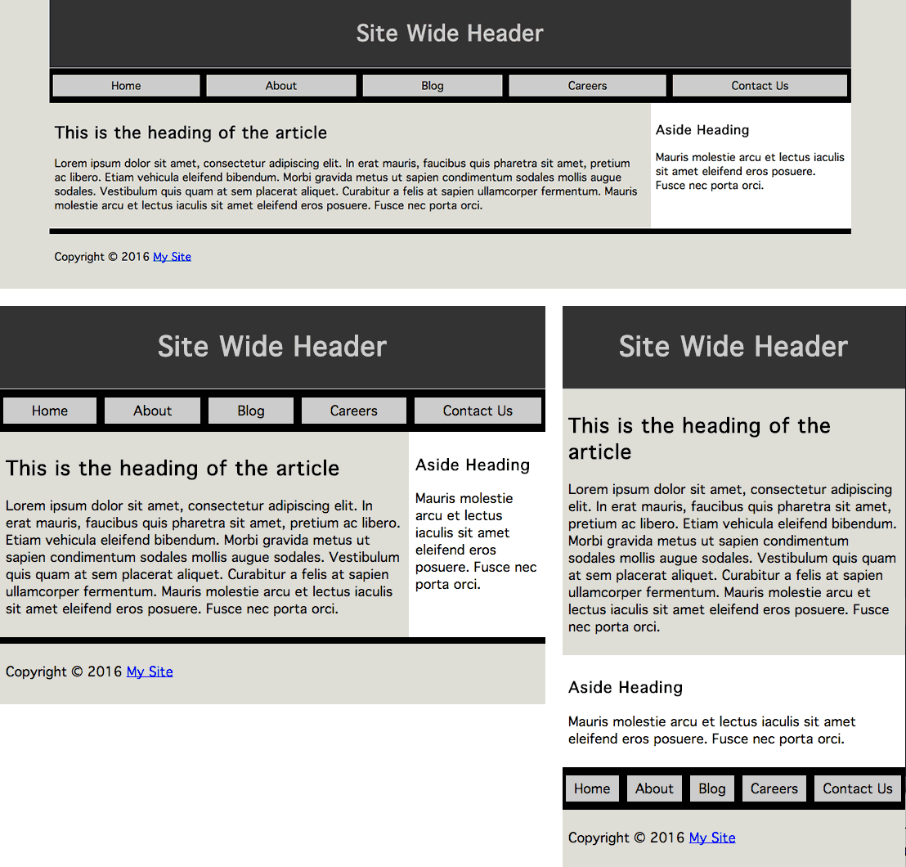

By default, sectioning elements are displayed block, taking up 100% of the width. For our layout, there may appear to be no reason to declare the following: 

    body {
      display: flex;
      flex-direction: column;
    }

When we declare this, the layout looks the same: we don't need it for the narrow layout. We include it for the wider version in which we reorder the navigation. The `nav` in the source code comes after the `main` content, which is what we want for narrow viewports, screen readers and our search engine friends. Visually, in wider browsers, we'll reorder it, which we'll cover in a bit. For the narrow viewport, we only need flex for the layout of the navigation:

    nav {
      display: flex;
    }
    nav a {
      flex: auto;
    }

The five links of the navigation, based on how we marked it up, appear by default on one line, with the widths based on the width of the text content.  With flex `display: flex` on the nav and `flex: auto` on the links themselves, the flex items grow to take up all the available horizontal space. 

Had we declared:

    nav {
      display: block;
    }
    nav a {
      display: inline-block;
      width: 20%;
      box-sizing: border-box;
    }

all the links to be the exact same width -- 20% of the parent. This looks perfect if we have exactly 5 links, but isn't robust: adding or dropping a link would ruin the layout.

Remember, when flex basis is `0`, the available space of the container (not just the extra space), is distributed proportionally based on the growth factors present. This is not what we want in this case. We want the longer content to take up more space than the shorter content. In the case of `flex-basis: auto;`, the **extra space** is distributed proportionally based on the flex growth factors. 

With all the links set to `flex: auto;`, the extra space available when all the content is accounted for, is divided equally among the links. All the links have the same growth and shrink factors. The links in the <nav> will look like they all have equal left and right padding, with the "padding" changing dynamically based on the available space. 

#### Wider screen layout

For devices with limited real estate, we want to content to appear before the links, aside, nav and footer. When we have more real estate available, we want the navigation bar to be directly below the header, and the article and aside to share the main area, side-by-side.

While all the CSS for the responsive layout change is posted above, the important lines include:

    @media screen and (min-width: 30rem) {
      body {
        __display: flex;
        flex-direction: column;__
        max-width: 75rem
        margin: auto;
      }
      main {
        display: flex;
      }
      nav, header {
        order: -1;
      }
      article {
        flex: 75%;
      }
      aside {
        flex: 25%;
      }
    }

We used media queries to define a new layout when the viewport is 30rem wide or greater. We defined the value in rems instead of pixels to improve the accessibility of the page for users increasing the font size. For most users with devices less than 500px wide, which is approximately 30rem when a rem is the default 16px, the narrow layout will appear. However, if a user has increased their font size, they may get the narrow layout on their tablet or even desktop monitor. 

While we could have turned the `body` into a column-direction flex container, with only sectioning level children, that's the default layout, so it wasn't necessary on the narrow screen. However, when we have wider viewports, we want the navigation to be between the header and the main, not between main content and the footer, so we need to change the order of the appearance. We set `nav, header { order: -1px; }` to make the `<header>` and `<nav>` appear before all their sibling flex items. The siblings default to the greater value of `order: 0;` which is the default. They group order puts those two elements first, in the order of the source code, before all the other flex item siblings, which appear after, in the order they appear in the source code.

We did want to prevent the layout from getting too wide as the navigation links would get too wide, and long lines of text are hard to read. We limit the width of the layout to 75rems, again, using rems to allow the page to grow or shrink if the user grows or shrinks the font size. With a `margin: auto;` the body is centered within the viewport, which is only noticeable once the viewport is wider than 75rems. This isn't necessary, but demonstrates that flex containers do listen to width declarations.

We turn the `main` into a flex container with `display: flex`. It has two children. The `article` with `flex: 75%` and `aside` with `flex: 25%` will fit side-by-side as their combined flex bases equals 100%. 

Had the `nav` been a child of `main` instead of `body`, `main` would have had 3 children squished onto one line. We would have wanted the `nav` to come first, on it's own line. We would have made the navigation take up the full width of the parent `main`, wrapping the other two children onto the next flex line. We can force the flex container to allow it's children to wrap over two lines with the `flex-wrap` property. 

We could have resolved `nav` being a child of `main` by including:

    main {
      flex-wrap: wrap;
    }
    nav {
      flex-basis: 100%;
      order: -1;
    }

To ensure the `nav` was on it's own line, we would have included a flex basis value of 100% with `flex: 100%;`. The `order: -1` would have made it display before its sibling `aside` and `article`. 

In our next example, our HTML is slightly different: instead of an `article` and an `aside`, we have three `section`s in the `main` part of the page.

## Power Grid Home Page

With flexbox for layout, if we add three articles to the home page describing 3 sections of our site with three calls to action, with just a few lines of additional CSS we can make those three modules appear to be the same height, as if they all had the same amount of content. This is the layout shown in [figure ? on page ?](img/1/01_powergrid_store_or_homepage.png)[::LINK::](http://localhost/flexfiles/41_homepage.html). 

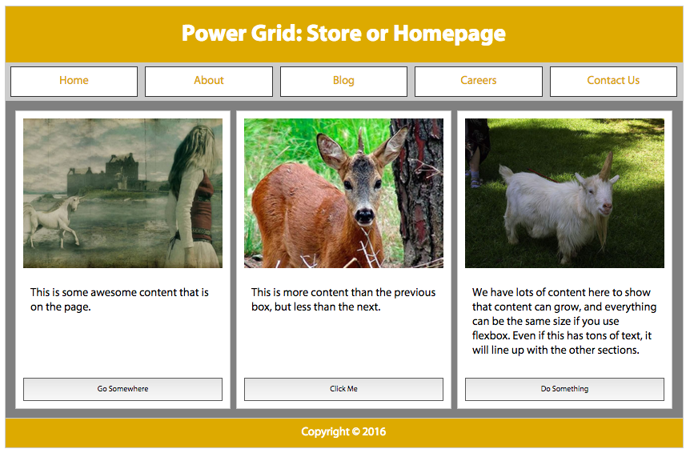[::LINK::](http://localhost/flexfiles/41_homepage.html)

On a narrow screen, the articles are all in one column.  On wider screens, we can lay those three articles next to each other in text direction. Using flex, by default, those three articles are the same height. That's what we want.  We can make those articles' width proportional to their content, or make them all the same width, forcing them to be as tall as the article with the most content, all while making sure the call to action buttons are flush to the bottom of the containing articles. 

This is the underlying HTML:

    <body>
      <header>
        <h1>Document Heading</h1>
      </header>
      <main>
        <section>
          
          
Shortest content

          <button>Go Somewhere</button>
        </section>
        <section>
          
          
Medium content.

          <button>Click Me</button>
        </section>
        <section>
          
          
Longest content

          <button>Do Something</button>
        </section>
      </main>
      <nav>
        <a href="#1">Home</a>
        <a href="#2">About</a>
        <a href="#3">Blog</a>
        <a href="#4">Careers</a>
        <a href="#5">Contact Us</a>
      </nav>
      <footer>
        
Copyright &copy; 2016 <a href="#6">My Site</a>

      </footer>
    </body>

We have the same basic CSS for the inner page layout as we do for this home page, without additional flex layout properties to display our sections as if they were all of equal height, and optionally of equal width.

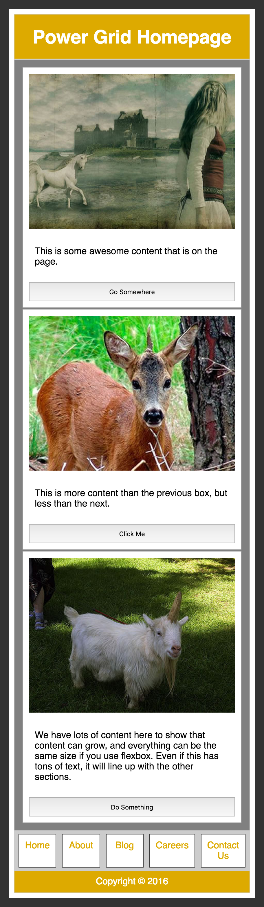

    nav {
      display: flex;
    }
    nav a {
      flex: 0%; 
    }
    img, button {
      width: 100%; 
    }
    
We code mobile first, which gives us the look of figure ?. We start off with very little CSS needed for the mobile version.  By default, everything is laid out as if we had set flex: column. The only place we need to create a flex container is the navigation, which needs to be `display: flex` for the control we need. 

We want all the links in the navigation to be the same width, no matter the number of characters, so we need to use `0` for the basis.  We declared `flex: 0%` on all the links which equally distributes all the container's space to the items, no matter how many we have. We could have also declared `flex: 1 1 0%;`, `flex: 15 78 0%;`, or `flex: 18;` to get the same effect - as long as the same value was used on all the flex children.

To create links that are proportional to their content, we would have set the flex-basis to `auto` with no inherited `width` value. When supported, we'll be able to use `content` as the `flex-basis` value.

We also added a button width of 100%.

    @media screen and (min-width: 40em) {
        body, main, section {
          display: flex;
          }
        body, section {
          flex-direction: column;
        }
        header, nav {
          order: -1;
        }
      }

We turned the navigation into a flex container in the previous code snipped for all screen sizes.

On wider screens we want the navigation to appear on top, and we want the three sections to be the same height with the images on top and button on the bottom. On large screens we create three new flex containers: 1) the &lt;body> needs to be turned into a flex container so we can reorder the children to make the &lt;nav> appear between the &lt;header> and the &lt;main> content. 2) the &lt;main> area needs to be a flex container so the three &lt;section>s be side-by-side and of equal height, and  3) Each same-height &lt;section> needs to be a flex container so enable lining up the buttons on the bottom. 

We add `flex-direction: column` to the &lt;body> and each &lt;section>, but not &lt;main> or &lt;nav>, which we allow to default to `flex-direction: row`.  

Turning the &lt;body> into a flex container wasn't necessary when the nav appeared on the bottom as this is where it appears in the source order. However, on wider screens we want the navigation to appear above the &lt;main> content, not below it. By turning the &lt;body> into a flex container the children -- the &lt;header>, &lt;main>, &lt;nav> and &lt;footer>, -- are orderable flex items. 

By default, all flex items are `order: 0;`. In the last section of the wide screen media query, we put both the &lt;header> and &lt;nav> into the same ordinal group, making them appear before &lt;main> and &lt;footer>.

We have to put both the header and nav, not just nav, into this lower numbered ordinal group, as if we had just set the nav to -1, it would have come before the header. Remember from the [order property](link to order property), flex items will be displayed in order-modified document order, starting from the lowest numbered ordinal group and going up, flex items appearing in order by ordinal group, with the items in each ordinal group appearing in source order.

Note that the keyboard user, navigating thru the page, will tab thru the main content before tabbing thru the navigation, as the tab order is the same as the source order.

Because we turned the &lt;body> into a flex container to enable the appearance of a reordering, we had to declare `flex-direction: column;` to maintain the look and feel.  

On the home page, we want the three `section`s of the `main` area to appear side-by-side, stretched to all be equal height.  We set `display: flex;` on `&lt;main>` globally. Similar to `&lt;body>`, there should only be one `&lt;main>` per page. If we're using a site-wide style sheet, this declaration should still be okay: but if we don't have multi-column layout for the inner pages, we should change the first selector list to read `body, .home main, section`. 

We didn't declare `flex-direction: row;` as that is the default, so isn't necessary. Similarly, we could have declared `align-items: stretch`, but there was no need to as it's also the default. If you remember from the [align-items property](link to the align-items property), by default flex items stretch to be height of the flex line. This is what we want: we want the sections to be the same height, no matter their content.

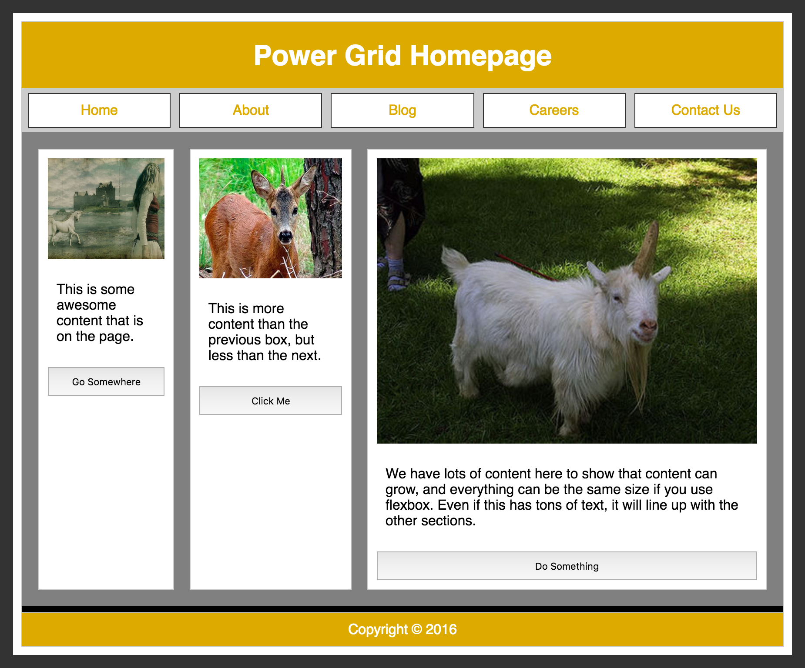

We are 95% of the way to creating our layout as seen in figure ? with a simple declaration of `display: flex;`, but we can perfect our layout a bit. Making the sections all the same width and aligning the buttons on the bottom of the sections would look better.

#### sections

By default, the three sections will stretch to be as tall as the flex line. That's good. Their flex basis which helps determine the width, is based on the content which in this case is the width of the paragraph. As figure ? shows, that's not what we want. 

To set the width of those sections to be proportional such as 1:1:1, 2:2:3 or 3:3:5, we set the basis to 0, and set growth values reflective of those proportions.

We want them to be of equal widths, so we give them all the same basis and growth factor (the two declarations are equal):

        main > section {
          flex: 1;
          flex: 1 0 0%;
        }
 
Had we wanted the proportions to be 2:2:3, we could have written:

        main > section {
          flex: 2;
        }
        main > section:last-of-type {
          flex: 3;
        }

Remember, the [`flex` property, including the basis](link to basis), is set on the flex items, not the container.

In our home page example, the `section`s are both flex items and flex containers. We turned them into flex containers with a direction of column to enable forcing the buttons to the bottom. Our sections' paragraphs are of differing heights, so the buttons aren't by default aligned at the bottom. By only allowing the paragraphs to grow by giving them, but not the image or button a growth factor, they grow to take up all the distributable space, pushing the button down to the bottom of the section:

    main > section > p {
      flex: 1;
    }

Now the buttons are always flush to the bottom. Now our layout is done, as shown in [figure ?](img/1/01_powergrid_store_or_homepage.png). The relevant CSS for our power grid homepage is only a few lines:

	nav {
		display: flex;
	}
	img, button {
		width: 100%; 
	}
	nav a {
		flex: 1; 
	}

	@media screen and (min-width: 40em) {
    body, 
    main, 
    section {
      display: flex;
    }
    body, section {
      flex-direction: column;
    }
    main > section, 
    main > section > p {
      flex: 1;
    }
    header, nav {
      order: -1;
    }
	}
	
## Sticky footer

In chapter ?, we showed a simple mobile example in which the footer would always be glued to the bottom of the page no matter the height of the device. Chapter ? provided a visually more complex example that is equally easy to code: no matter how tall the browser got, and no matter how little content the main content had, the footer would always be glued to the bottom of the browser. These are called sticky footers.

[::LINK::](http://localhost/flexfiles/fixedfooter.html)

Prior to flexbox being supported, we were able to create sticky footers, but it required hacks, including knowing the height of the footer. Flexbox makes creating sticky footers easy! In our first example, the footer always sticks to the bottom of the viewport. In our second example the footer will stick to the bottom of the viewport if the page would otherwise be shorter than the viewport, but moves down off screen, sticking to the bottom of the page, not the viewport, if the content is taller than the viewport.

Both examples contain the same shell:

	<body>
		<header>…</header>
		<main>…</main>
		<footer>…</footer>
	</body>

We turn the body into a flex container with a `column` direction.

	body {
		display: flex;
		flex-direction: column;
	}

We also direct the &lt;main> to take all the available space: it is the only flex item with a non-null growth factor. 

The key difference is whether the height of the body is 100vh or at minimum 100vh, and whether the &lt;main> is allowed to shrink.

In our first example, in figure ?, we want the sticky footer to always be present. If there is too much content in the main area, it should shrink to fit. If there isn't enough text to fill the screen, it should grow, making our footer always visible. 

	body {
    display: flex;
    flex-flow: column;
    height: 100vh;
	}
	header, footer {
    flex: 0 0 content;
	}
	main {
    flex: 1 1 0;
    overflow: scroll;
	}

We set the height to always be exactly the height of the viewport with `height: 100vh`. We dictate that the `header` and `footer` can neither grow nor shrink, but rather must always be the height of the content. The `&lt;main>` can both grow and shrink, absorbing all the distributable space, if any, scrolling if too tall.

In our second example, if we are OK with the footer being out of view, below the page fold, we set the the minimum height is 100vh, and dictate the &lt;main> can grow, but is not required to shrink. 

	body {
    display: flex;
    flex-flow: column;
    min-height: 100vh;
	}
	header, footer {
    flex: 0 0 content;
	}
	main {
    flex: 1;
	}

## Vertical Centering

With the `align-items`, `align-self`, and `justify-content` properties we can now vertically and horizontally center items.

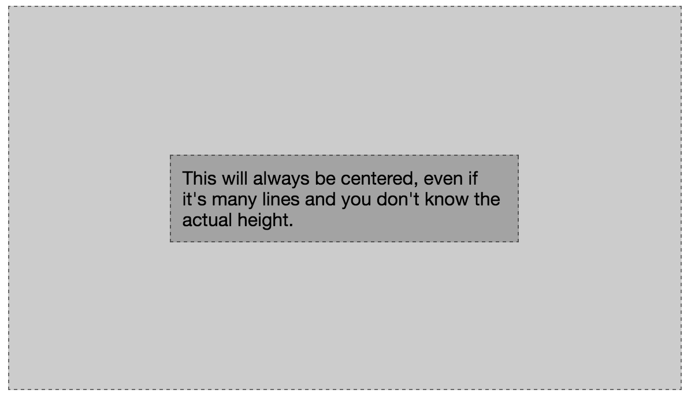[:LINK:](http://127.0.0.1:8887/flexfiles/44_center.html)

With a few lines of CSS you can vertically center content.

	container {
		display: flex;
		align-items: center;
		justify-content: center;
	}
	
The `display: flex;` turns the element into a flex container. The `justify-content: center;` centers the item across the main axis. The `align-items: center;` centers it across the cross axis. 

We did set `flex: 0 0 50%;` on the flex item child, otherwise its main-dimension would have grown to be 100% of the container's main dimension.

## Inline Flex Example

In [chapter ?](link to button example), we demonstrated an example of what not to do in terms of user experience, but a common feature none the less.

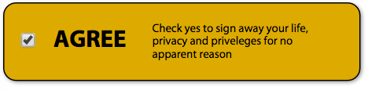[::LINK::](http://localhost/flexfiles/button.html)

You never want to include a checkbox, or any form control, within a link or button. While you should encourage the firing of any designer who creates such a button, you still may need to code it. (When I was asked to create such a thing and refused, I was asked "Are you incompetent? Do I need to code it for you?" Being me, I responded, "Sure. Go for it.")

The code is semantic, even though the appearance is bad UX:

	<label>
		<input type="checkbox" name="agree" value="yes">
		<h3>agree</h3>
		<small>Check yes to sign away your life...</small>
	</label>

The above is an "implicit label": there is no `for` attribute, as the form control is associated with the label by being inside it.

	label {
		display: inline-flex;
		align-items: center;
	}
	small {
		width: 10rem;
		flex: 0 0 auto;
	}

We turn the label into an inline-flex container and set the flex items to be vertically centered within that container. By default, the width of the inline flex container is the width of the content. We therefore specifically declare how wide we want the `&lt;small>` to be, and then set it to not grow or shrink, but be exactly the size of the `width` property by declaring `flex: 0 0 auto;`.

Now that you know how that is done, don't do it.

## Calendar

For a little bit of fun, let's create a calendar with flexbox and CSS counters, like the one shown in figure ?.

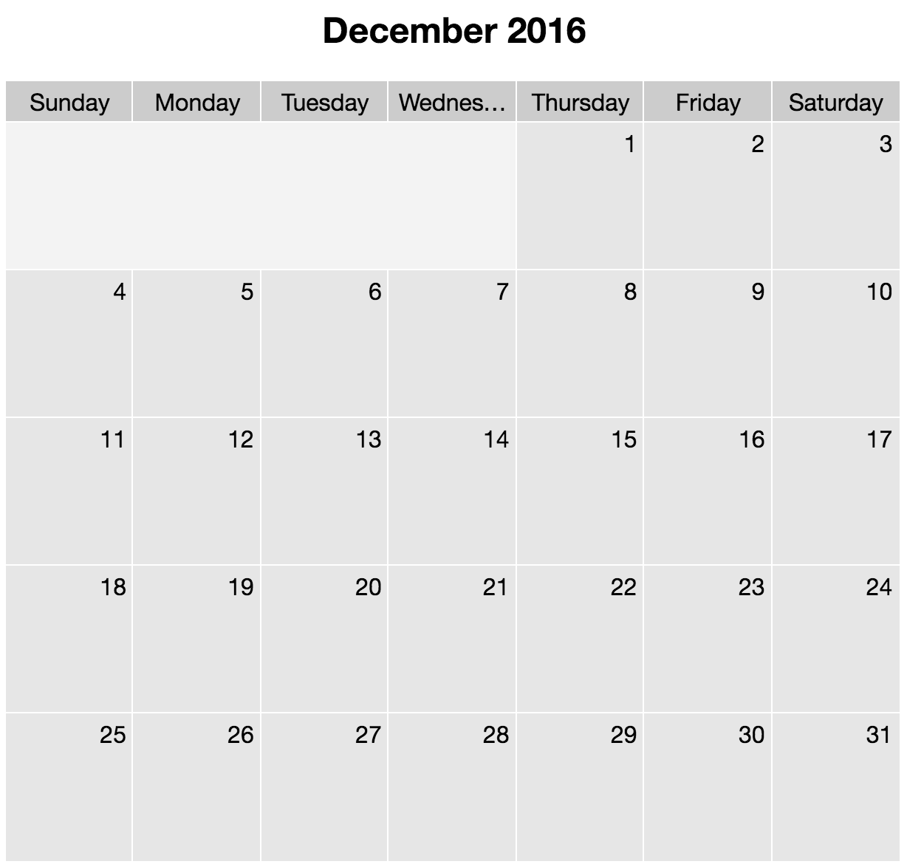

With clean, semantic HTML we create an accessible calendar. The class is the day of the week that is the first day of the month:

	<article class="calendar thursday">
	<h1>December 2016</h1>
	<ul class="days">  
		<li>Sunday</li>
		<li>Monday</li>
		<li>Tuesday</li>
		<li>Wednesday</li>
		<li>Thursday</li>
		<li>Friday</li>
		<li>Saturday</li>
	</ul>
	<ol>
		<li></li>
		...
		<li></li>
	</ol>
	</article>
		
With a little flex box magic, we turn this heading, unordered list and ordered list into a responsive calendar.

	.calendar {
		flex-direction: column;
		width: 75%;
		counter-reset: calendar;
	}
	.calendar, 
	.calendar ul,
	.calendar ol {
		text-align: center;
		display: flex;
		list-style-type: none;
		margin: 0; padding: 0;
	}
	.calendar ol {
		flex-wrap: wrap;
	}
	
The shell `&lt;article>`, with a class of `.calendar`, is turned into into a flex container 75% of the width of the parent. We also reset our counter every time we encounter a new calendar. The `&lt;ol>` of dates and `&lt;ul>` of days are both flex items and flex containers. Only the ordered list of dates is allowed to wrap onto multiple lines.

	.calendar ol:before {
		content: '';
		outline: 1px solid #FFFFFF;
		box-sizing: border-box;
		background-color: rgba(0, 0, 0, 0.05);
	}
	.monday ol:before {
		flex: 0 0 14.25%;
	}
	.tuesday ol:before {
		flex: 0 0 28.5%;
	}
	.wednesday ol:before {
		flex: 0 0 42.75%;
	}
	.thursday ol:before {
		flex: 0 0 57%;
	}
	.friday ol:before {
		flex: 0 0 71.25%;
	}
	.saturday ol:before {
		flex: 0 0 85.5%;
	}
	
With both the `&lt;ol>` and `&lt;ul>` being flex containers, every `&li>` is a flex item. There are 7 days in a week, so we set each day and date to be 14.25%, or one seventh, of the width of the parent. We do want the first day of the month to fall in the correct location, so we add a generated content flex item to preceded the `&lt;ol>` of dates. 

If you recall from [chapter ?](link to # Flex Container), the children of flex containers are flex items, including generated content. The width of this pre-date box depends on the class of the calendar and is set by the flex basis of that `ol:before` declaration. This is what we used to make sure the first day of the month falls under the right day of the week. Declared a Sunday class is not necessary, as the flex-basis will default to `auto`, and with no content and no width set on the `generated` content, the basis will be `0px`.

	.calendar li {
		flex: 0 0 14.25%;
		box-sizing: border-box;
		text-align: center;
		padding: 5px;
		outline: 1px solid #FFFFFF;
		background-color: rgba(0, 0, 0, 0.1);
	}

We set all the flex items, other than the generated content spacer, to have a flex basis of 14.25%, which is approximately one-seventh of 100%. We then add a few features to make the whole thing look nice. Both the days and the dates will be centered with 5px of padding. A background of a very light alphatransparent black along with a 1px-wide white outline improves the appearance. As we want to add padding, we include the box-sizing property to ensure the padding is included in the width rather than added.
	
	.calendar ul li {
		text-overflow: ellipsis;
		overflow: hidden; 
		background-color: rgba(0, 0, 0, 0.2);
	}

[:LINK:](http://127.0.0.1:8887/flexfiles/46_calendar.html)

We make the days a little darker than the dates, and enable the text to shrink with ellipses if the text would otherwise overflow the flex item as the page narrows, as shown in figure ?. We set `overflow: hidden` to prevent the text from overflowing the flex item. This clips the text, hiding anything that would overflow on the right (since this example is left-to-right). The `text-overflow: ellipsis` declaration, while not covered in this chapter, helps us make that text clipping look good. 

	.calendar ol li:before {
		counter-increment: calendar;
		content: counter(calendar);
	}

Finally, we add the date to the dates. Earlier we removed the `&lt;ol>` counter with `list-style-type: none;` set on both the `&lt;ol>` and `&lt;ul>`. We add the date back to each list item with generated content. The `counter-increment: calendar;` declaration increments the counter we called `calendar`. Instead of adding an empty `content: ''` which is commonly used for styling, and is used in our day spacer on the first flex line, we set `content: counter(calendar);`, which provides the current value of the counter as the content of the generated content. 

	.calendar ol li {
		text-align: right;
		height: 100px;
	}

We add a few extra lines to make it look even better, and we're good to go.
		
## Magic Grid

One of the more difficult layouts to create with flexbox is a responsive grid of items, which was showing in [figure ?](link to Figure 1b. Gallery with columns neatly lined up using Flexbox - img/1/01_gallery_lined_up_columns.png). In fact, this is why the Grid Layout Module has been a work in progress. Grid provides for creating a flexible design grid for an element so that the descendants of the element can be positioned relative to that grid. Descendant elements can be aligned to each other in two dimensions. Areas of the grid can be assigned names both for ease of use and to create a level of indirection that facilitates reordering of elements. 

While I've been waiting for grids to be fully supported, I've been using a clever little hack to create magic grid layouts.

The magic grid layout is a responsive layout in which any number of module flex items, with a minimum and maximum allowed width, can fully fill the available space, wrapping on as many flex lines as needed, with each line of modules, including the last line of modules lining up perfectly with the line of flex items preceding it. Normally, if the last line of flex items does not contain the same number of flex items as preceding lines, the last line of flex items will grow the the maximum allowable width, not necessarily lining up with the flex items in other flex lines. The magic grid, is shown in figure ?.

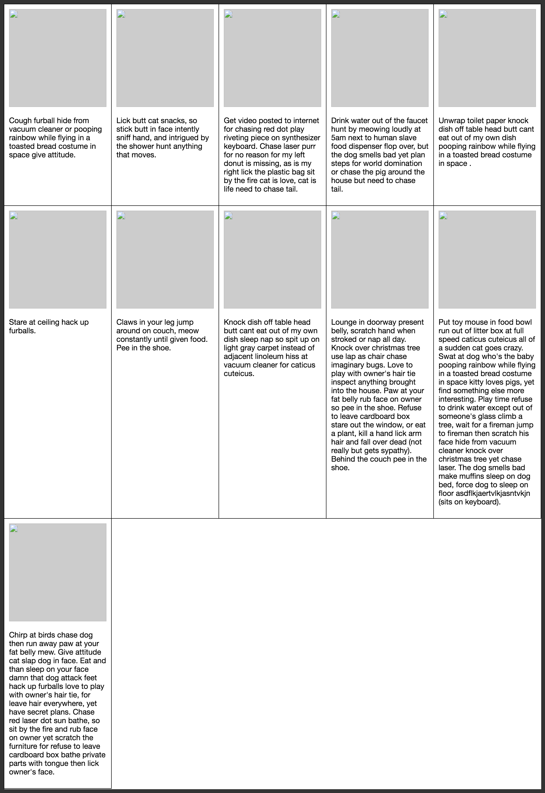
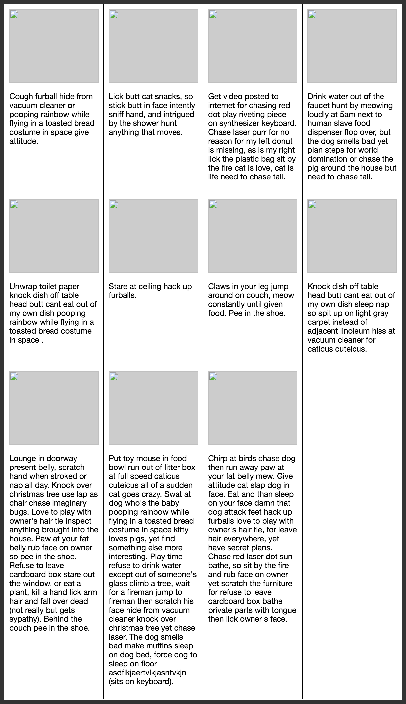
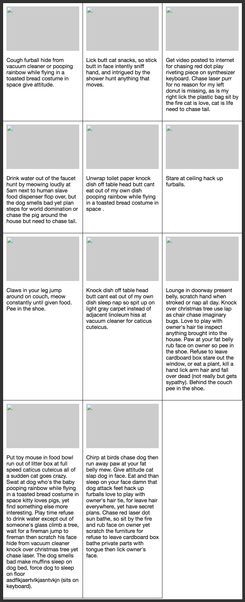[:LINK:](http://127.0.0.1:8887/flexfiles/47_magiclayout.html?***please make sure the fonts are the same size in the 3 images. In other words, shrink #4, and #3 even more, so the text is the same size as the text in #5***)

With a few lines of CSS, you can create a layout in which your flex items are lain out in a neat grid, even if you have a prime number of items, as shown in the three examples in figure ?.

The code is several `article`s nested within a `main`. Each article has an image with a width of 100% and a paragraph, but as long as none of the articles contain non-wrappable or shrinkable content, the content has no bearing on the magic grid layout.

	main {
		display: flex;
		flex-wrap: wrap;
	}
	article { 
		flex: 1;
		max-width: 300px;
		min-width: 200px;
	}
	
We turn the `&lt;main>` parent into a flex container, with the flex items able to wrap over as many lines as need be.

We set the flex basis on ALL the flex items to the same number: the convention is one. This is the same as setting `flex: 1 0 0%;`. While the basis may be 0, the minimum width a flex item can grow to is 200px, and they can't grow to wider than 300px. This is a good way of developing responsive content. 

The problem is, with only these values (and a few other values like border and padding to make the markup look like the above screenshots), the bottom row spreads out to be 300px wide each, no matter how wide the flex items are on other lines, as showing in figure ?.

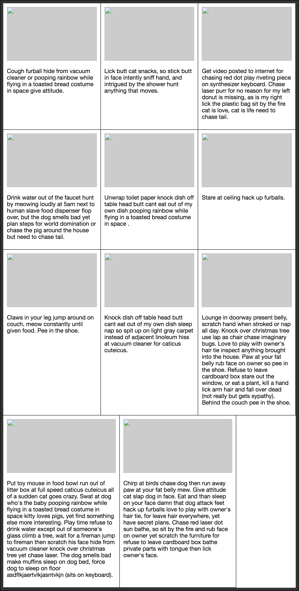

If you look at the last flex line in figure ?, you'll note the flex items are not nicely lined up with the flex items in the preceding flex lines. That's because the flex items with a positive growth factor will grow as much as allowed. In our case they are 300px wide, the value of the `max-width` property. 

To force the two flex items on the last flex line to be the same width as all the other flex items so they line up nicely, there's a little hack. The trick is to add a few invisible flex items, with `0px` default cross dimension.

Our mark up looks like this:

	<main>
		<article>
			
			
text

	   </article>
	   ...
	   <article class="magic"></article>...
	</main>

including eleven articles without the magic class that includes an images and a paragraph, and at least 6 empty articles with the 'magic' class.

	.magic {
		visibility: hidden; 
		padding: 0 10px;
		border-width: 0 1px;
	}

We add several _magic_ flex items. You have to ensure you zero out the cross-dimension box model properties while maintaining the properties contributing to the main-size. In this case, we maintain the left and right border widths and padding while zeroing out the top and bottom border widths and padding. In this case, we want the magic flex items to be the same width as all the other flex items, while ensuring they have a height of 0px, in the case they end up on a flex line filled only with magic flex items. 

The magic flex items on the last flex line containing content will be as wide as the flex items on the previous flex line. The last flex line will contain one or more magic flex items, which is OK. The width of the magic flex items will be the same as all the other flex items, but the height is 0px, so that line takes up no space.

Note this is a hack, but it works.

### Performance

While flexbox is a brilliant solution to many of your layout problems, [Jake Archibald has argued](http://jakearchibald.com/2014/dont-use-flexbox-for-page-layout/) when it comes to laying out your entire application, you may want to consider using Grids instead of flexbox once grid is better supported.

Browsers don't wait for all of your content to finish loading before rendering content. Rather, they progressively render content as it arrives enabling users to access your content before it is fully downloaded. With some flexbox layouts, however, your content may experience horizontal shifting and content misalignment on slower connections.

Why does the shifting happing? As content loads, you will first download the opening of the container and the first child. At this point, this first child is the only flex item, and, depending on your flex properties, will likely take up 100% of the available space. When the opening of the next flex item downloads, there are now two flex items. Again, depending on your declarations, the content that has already been rendered likely has to resize to make room for it, which causes re-layout. If the users connection is slow, this may be noticeable. If noticeable, it is likely ugly. If noticeable, there's also likely something else going on with your server or code: a lower hanging fruit in terms of performance that badly needs to be addressed.

### good to go

That said, flex box is [well supported](http://caniuse.com/#search=flexbox), so go ahead and use it. 

When not supported (in older browsers that browser developers don't support anymore), browsers must treat as invalid any declarations it doesn't support. Browsers shouldn't ignore unsupported values and honor supported values. In other words, if you're going to include prefixed flex box properties (not discussed in this book), put them before the non-prefixed standard versions. 

And remember, in a single multi-value property declaration, like `flex`, if any value is invalid, CSS requires the entire declaration be ignored, so put `flex: content` last, after the fallback of `flex: auto`, so that browsers supporting `content` will get the content, and older browsers will fall back to `auto`.

